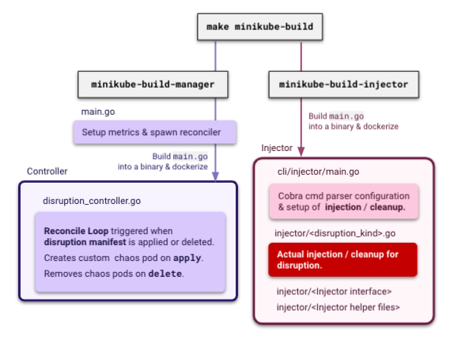
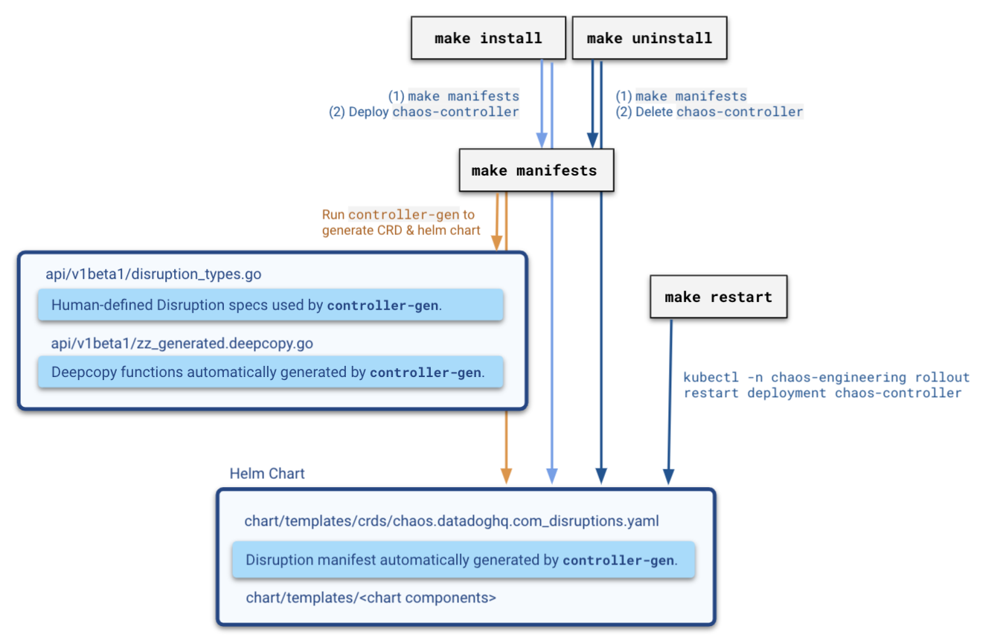

# Contributing

This document explains how to install and run the project on a local minikube cluster.

## Signing commits using `gpg`

* Download gpg [here](https://gnupg.org/download/)
* [Generating a new `gpg` key](https://docs.github.com/en/github/authenticating-to-github/managing-commit-signature-verification/generating-a-new-gpg-key)
* [Add `gpg` key to your GitHub account](https://docs.github.com/en/github/authenticating-to-github/managing-commit-signature-verification/adding-a-new-gpg-key-to-your-github-account)
* [Tell git about your signing key](https://docs.github.com/en/github/authenticating-to-github/managing-commit-signature-verification/telling-git-about-your-signing-key)
* [Automatically sign all commits](https://docs.github.com/en/github/authenticating-to-github/managing-commit-signature-verification/signing-commits)

## Requirements

To get started, we need to have the following software installed:

* [docker](https://docs.docker.com/get-docker/)
* [minikube](https://kubernetes.io/docs/tasks/tools/install-minikube/) (1: Installation)
* [golangci-lint](https://github.com/golangci/golangci-lint)
* [Kubebuilder Prerequisites](https://book.kubebuilder.io/quick-start.html#prerequisites) (go, docker, kubectl, kubebuilder, controller-gen)
* [helm](https://helm.sh/docs/intro/quickstart/)

# Developing Locally

## Quick start with Minikube

Once you have installed the above requirements, run the following commands:

* start minikube with containerd engine
  * `make minikube-start`
* deploy cert-manager
  * `kubectl apply -f https://github.com/jetstack/cert-manager/releases/download/v1.3.0/cert-manager.yaml`
* build the new image of the controller with your local files
  * `make minikube-build`
* deploy the CRD and the controller on the minikube cluster
  * `make install`

## Deploying Local Changes to Minikube

To deploy a new version of your local controller code when a version is already deployed, run:
* `make minikube-build`
* `make install`
* `make restart`

To deploy a new version of the CRD by modifying your local `api/v1beta1/disruption_types.go` (or a particular Subspec by modifying `api/v1beta1/disruption_types.go`), run:
* `make install`
* `make restart`

## Testing Local Changes in Minikube

### Testing manually

The [samples](examples/) contains sample data which can be used to test your changes.

[demo.yaml](examples/demo.yaml) contains testing resources you can apply directly to your cluster in whatever namespace you choose (`chaos-demo` by default) by running:
  * `minikube kubectl -- apply -f examples/demo.yaml`

To see whether curls are succeeding, by using kubectl to tail the pod's logs, run:
  * `minikube kubectl -- -n chaos-demo logs -f <curl pod> curl`

Once you define your test manifest, run:
  * `minikube kubectl -- apply -f examples/<manifest>.yaml`

To remove the disruption, run:
  * `minikube kubectl -- delete -f examples/<manifest>.yaml`

See [development guide](docs/development.md) for more robust documentation and tips!

### Testing with end-to-end tests

The project contains end-to-end test which are meant to run against a real Kubernetes cluster. You can run them easily with the `make e2e-test` command. Please ensure that the following requirements are met before running the command:

* you deployed your changes locally (see [Deploying Local Changes to Minikube](#deploying-local-changes-to-minikube))
* your Kubernetes context is set to Minikube (`kubectx minikube` for instance)

The end-to-end tests will create a set of dummy pods in the `default` namespace of the Minikube cluster that will be used to inject different kind of failures and make different assertions against those injections.

## Available commands

### Running, installing & generating

* `make generate`: generate boilerplate code.
* `make install`: install CRDs and controller into a cluster
* `make manifests`: generate manifests e.g. CRD, RBAC etc.
* `make uninstall`: uninstall CRDs and controller from a cluster
* `make restart`: restart the controller

### Building

* `make minikube-build`: build both images and load them into minikube
  * `make minikube-build-injector`: build the injector image and load it into minikube
  * `make minikube-build-manager`: build the manager image and load it into minikube
* `make injector`: build injector binary
* `make manager`: build manager binary
* `make minikube-start`: start minikube with our ISO and containerd runtime

### Testing, checking & linting

* `make fmt`: run go fmt against the codebase.
* `make header-check`: check all files if they contain the correct header.
* `make license-check`: check if all third party modules contain a license and build the license database.
* `make lint`: run golangci-lint against codebase.
* `make test`: run tests
* `make e2e-test`: run end-to-end tests against the current context (cluster)
* `make vet`: run go vet against the codebase.

<kbd>
    
</kbd>

<kbd>
    
</kbd>

## Minikube ISO

See [minikube_image.md](docs/minikube_image.md)

## 3rd-party licenses

3rd-party references and licenses are kept in the [LICENSE-3rdparty.csv](LICENSE-3rdparty.csv) file. This file has been generated by the [tasks/thirdparty.py](tasks/thirdparty.py) script. If any vendor is updated, added or removed, this file must be updated as well.
