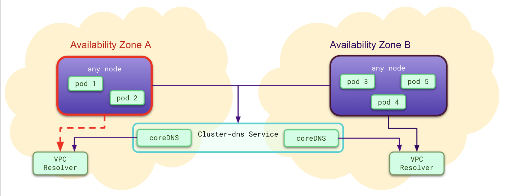
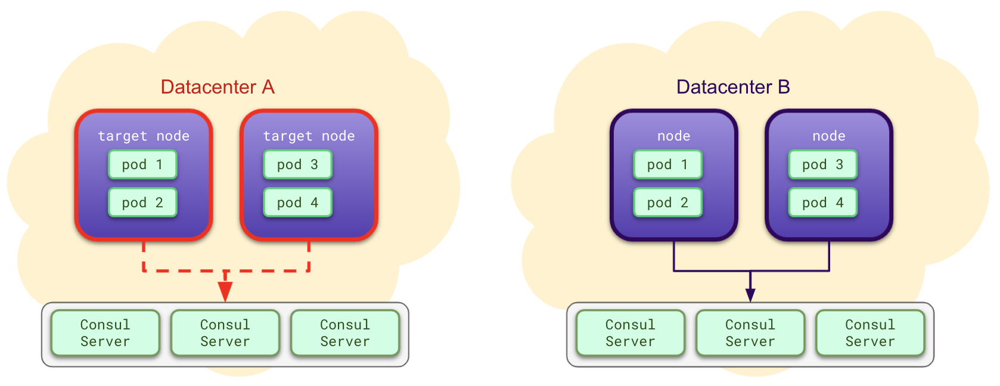
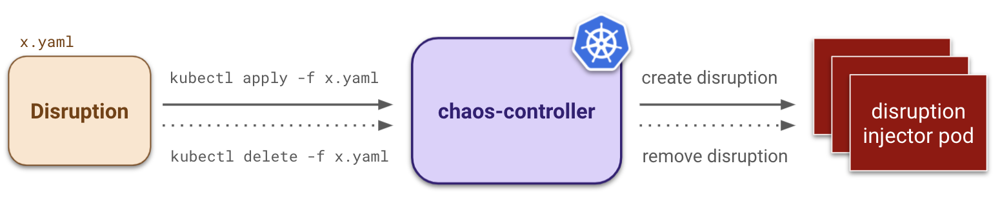

**Oldest Kubernetes version supported: 1.15**

> :warning: **Kubernetes version 1.20.x is not supported!** _This [Kubernetes issue](https://github.com/kubernetes/kubernetes/issues/97288) prevents the controller from running properly on Kubernetes 1.20.0-1.20.4. Earlier versions of Kubernetes as well as 1.20.5 and later are still supported._

# Chaos Controller

Datadog runs regular chaos experiments to test the resilience of our distributed cloud applications hosted in Kubernetes. The Chaos Controller facilitates automation of these experiments by simulating common "disruptions" including but not limited to: poor network quality, exhaustion of computational resources, or unexpected node failures. All you need to do to get started is define a `yaml` file which contains all of the specifications needed by our custom Kubernetes Resource to run the preferred disruption `Kind`.

## Gamedays

At Datadog, we use the Chaos Controller to run Gamedays where we intentionally introduce failures into staging and production systems to test the resilience of our critical applications.

<p align="center"><kbd>
    
</kbd></p>
<p align="center"><kbd>
    
</kbd></p>

The Chaos Controller allows us to simulate a variety of small and large scenarios (and combination of scenarios) such as a network degradation across an AZ which limits access to critical DNS resolvers (top) or a bad configuration triggering a “thundering herd” on Consul's key-value store (bottom).

## Local Development

Chaos Engineering is necessarily different from system to system. We encourage you to try out this tool, and extend it for your own use cases. If you want to run the source code locally to make and test implementation changes, visit the [Contributing Docs](CONTRIBUTING.md) which explain how to spin up chaos-controller source code on Minikube. By the way, we welcome Pull Requests.

## Quick Installation

If you do not plan to alter source code, you can install **Chaos Controller** to your existing Kubernetes environments by running:

```
kubectl apply -f https://raw.githubusercontent.com/DataDog/chaos-controller/main/chart/install.yaml
```

This `install.yaml` is generated for each new release and will always point to the latest stable version of the controller in Docker Hub.

If you use Helm you can install all the resources as follows:
```
helm install -f values.yaml chaos-controller ./chart
```

> :mega: _**Datadog engineers:** please reach out to Chaos Engineering before deploying to a new cluster! :pray: :bow:_

> :warning: _[cert-manager](https://cert-manager.io/docs/installation/kubernetes/) must be installed for the admission controller to get a self-signed certificate._

> :open_book: _The [Advanced Installation Docs](docs/installation.md) contain flags to customize webhooks, annotate injector pods, etc._

## Getting Started

Disruptions are built as short-living resources which should be manually created and removed once your experiments are done. They should not be part of any application deployment. The `Disruption` resource is **immutable**. Once applied, you can't edit it. If you need to change the disruption definition, you need to delete the existing resource and to re-create it.

Getting started is as simple as creating a Kubernetes resource:

```yaml
apiVersion: chaos.datadoghq.com/v1beta1
kind: Disruption
metadata:
  name: node-failure
  namespace: chaos-demo
spec:
  selector: # a label selector used to target resources
    app: demo-curl
  count: 1 # the number of resources to target
  duration: 1h # the amount of time before your disruption automatically terminates itself
  nodeFailure:
    shutdown: false # trigger a kernel panic on the target node
```

To disrupt your cluster, run `kubectl apply -f <disruption_file.yaml>`. You can clean up the disruption with `kubectl delete -f <disruption_file>.yaml`. For your safety, we recommend you get started with the `dry-run` mode enabled.

<p align="center"><kbd>
    
</kbd></p>

Check out [Chaosli](./cli/chaosli/README.md) if you want some help understanding/creating disruption configurations.

> :open_book: _The [features guide](docs/features.md) contains usecases and sample disruption files!_

> :open_book: _The [development guide](docs/development.md) contains tips for developing locally!_

## Useful Links

* [Examples](docs/features.md#examples)
* [Design](docs/design.md)
* [Metrics](docs/metrics.md)
* [FAQ](docs/faq.md)
* [Contributing](CONTRIBUTING.md)

## :bomb: Disclaimer :bomb:

_The Chaos Controller allows you to disrupt your Kubernetes infrastructure through various means including but not limited to: bringing down resources you have provisioned and preventing critical data from being transmitted between resources. The use of Chaos Controller on your production system is done at your own discretion and risk._
