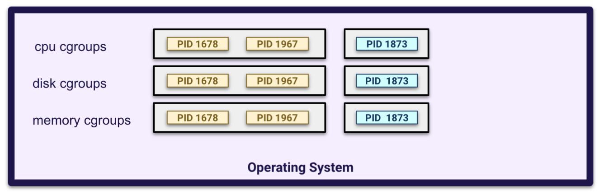
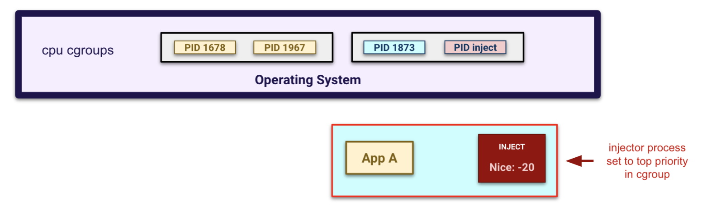
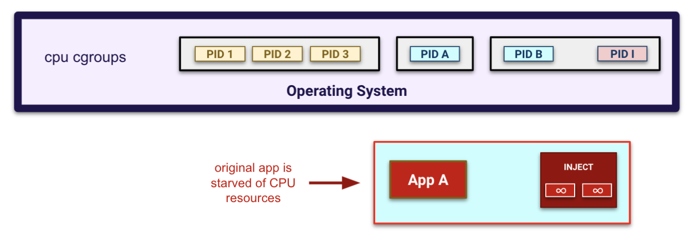

# CPU pressure

The `cpuPressure` field generates CPU load on the targeted pod.

## How it works

Containers achieve resource limitation (cpu, disk, memory) through cgroups. cgroups have the directory format `/sys/fs/cgroup/<kind>/<name>/`, and we can add a process to a cgroup by appending its `PID` to `cgroups.procs` file. Docker containers get their own cgroup as illustrated by `PID 1873` below:

<p align="center"><kbd>
    
</kbd></p>

> :open_book: More information on how cgroups work [here](https://www.kernel.org/doc/Documentation/cgroup-v1/cgroups.txt).

To join the CPU cgroup, the injector will:
* retrieve the targeted pod container cgroup path from the container data
* write its own [process group ID](https://linux.die.net/man/3/getpgid) to the `cgroup.procs` file

The `/sys/fs/cgroup` directory of the host must be mounted in the injector pod at the `/mnt/cgroup` path for it to work.

<p align="center"><kbd>
    
</kbd></p>

The injector pod starts and joins the targeted pod container CPU cgroup. It then starts as many goroutines as available CPU (or specified limit) and starts an infinite loop.

The injector increases its own priority to the maximum value (`-20`) to ensure to take as much CPU time as possible. It is done before goroutines start and on the whole process group, so every threads created the injector also have the maximum priority.

<p align="center"><kbd>
    
</kbd></p>

## Manually Confirming CPU Pressure

In a CPU disruption, the injector pid is moved to the target CPU cgroup but the injector container keeps its own pid namespace. Commands like `top` or `htop` won't see the process running just because they can't see the pid, although it uses the cgroup CPU.

This can be confirmed using top linux command.
* If you run `top` from within the targeted pod, you won't see the CPU usage increasing nor the injector process running.
* If you run `top` from within the injector pod, you'll see the CPU usage increasing even though it is not consuming this container CPU resource.
* If you run `top` from the node where the pod is running, you will also see the injector process eating CPU.

This because those tools are mostly relying on processes they can see to display resource usage. This can also be confirmed with benchmarking tools such as `sysbench` running on the different containers.

Example `sysbench` without the CPU pressure applied:

```
root@demo-curl-8589cffd98-ccjqg:/# sysbench --test=cpu run
Running the test with following options:
Number of threads: 1
Initializing random number generator from current time


Prime numbers limit: 10000

Initializing worker threads...

Threads started!

CPU speed:
    events per second:  1177.67

General statistics:
    total time:                          10.0004s
    total number of events:              11780

Latency (ms):
         min:                                  0.70
         avg:                                  0.85
         max:                                 18.00
         95th percentile:                      1.10
         sum:                               9975.80

Threads fairness:
    events (avg/stddev):           11780.0000/0.00
    execution time (avg/stddev):   9.9758/0.00
```

Example `sysbench` With the CPU pressure applied:

```
root@demo-curl-8589cffd98-ccjqg:/# sysbench --test=cpu run
Running the test with following options:
Number of threads: 1
Initializing random number generator from current time


Prime numbers limit: 10000

Initializing worker threads...

Threads started!

CPU speed:
    events per second:   115.48

General statistics:
    total time:                          10.5973s
    total number of events:              1224

Latency (ms):
         min:                                  0.72
         avg:                                  8.65
         max:                                906.92
         95th percentile:                     74.46
         sum:                              10592.69

Threads fairness:
    events (avg/stddev):           1224.0000/0.00
    execution time (avg/stddev):   10.5927/0.00
```