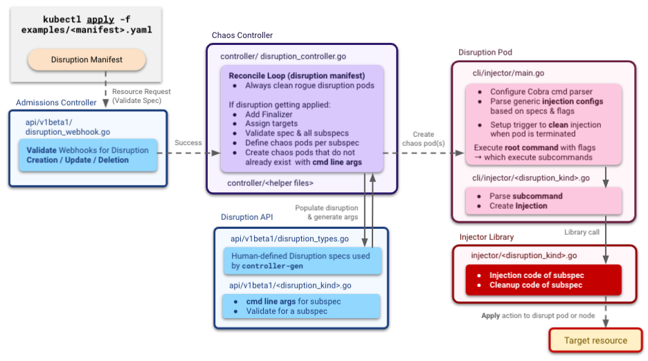
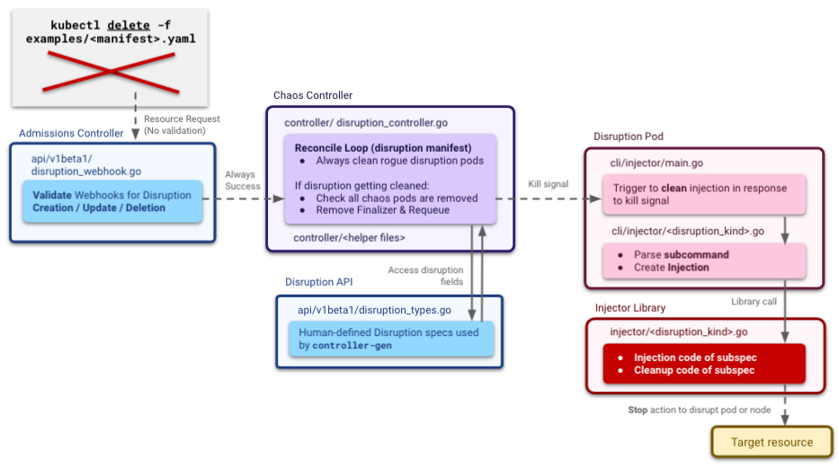

# Development Guide

## Testing Locally

[demo.yaml](examples/demo.yaml) contains testing resources you can apply directly to your cluster in whatever namespace you choose (`chaos-demo` by default), by running:

- `kubectl apply -f examples/demo.yaml`

## Applying your Manifest

Once you define your test manifest, run:

- `kubectl apply -f examples/<manifest>.yaml`

<p align="center"><kbd>
    
</kbd></p>

Applying the manifest triggers the admission controller which validates your yaml file.

### Successful validation

The resource request is passed to the reconcile loop which creates as many chaos pods as the number of disruptions kinds you included in your manifest. The controller also adds a `finalizer` to active disruptions so they are not cleaned up by Kubernetes before the disruption is cleaned up. Each chaos pod applies its specific disruption kind (`network_disruption`, `cpu_pressure`, `node_failure`, etc) to your target resources.

A successful apply prints:

- `disruption.chaos.datadoghq.com/"<manifest name>" created`

### Unsuccessful validation

An explanatory error message like the following will print:

- `Error from server (count must be a positive integer or a valid percentage value): error when creating "examples/network_drop.yaml": admission webhook "chaos-controller-admission-webhook.chaos-engineering.svc" denied the request: count must be a positive integer or a valid percentage value`

### Reapplying a manifest

Because Chaos Controller disruptions are immutable, the correct way to reapply a manifest after edit is actually to delete the resource entirely and then apply. Modifying an already applied manifest file and then reapplying it by only running `kubectl apply -f examples/<manifest>.yaml` will print an error message like the following:

```
Error from server (a disruption spec can't be edited, please delete and recreate it if needed): error when applying patch: {"metadata":{"annotations":{"kubectl.kubernetes.io/last-applied-configuration":"{\"apiVersion\":\"chaos.datadoghq.com/v1beta1\",\"kind\":\"Disruption\",\"metadata\":{\"annotations\":{},\"name\":\"network-drop\",\"namespace\":\"chaos-demo\"},\"spec\":{\"count\":10,\"level\":\"pod\",\"network\":{\"drop\":100,\"hosts\":[{\"host\":\"10.0.0.0/8\"},{\"port\":80}]},\"selector\":{\"app\":\"demo-curl\"}}}\n"}},"spec":{"count":10}}
to:
Resource: "chaos.datadoghq.com/v1beta1, Resource=disruptions", GroupVersionKind: "chaos.datadoghq.com/v1beta1, Kind=Disruption"
Name: "network-drop", Namespace: "chaos-demo"
for: "examples/network_drop.yaml": admission webhook "chaos-controller-admission-webhook.chaos-engineering.svc" denied the request: a disruption spec can't be edited, please delete and recreate it if needed
```

## Deleting your Manifest

Once you are done testing, you can remove the disruption by running:

- `kubectl delete -f examples/<manifest>.yaml`

<p align="center"><kbd>
    
</kbd></p>

Deleting the manifest triggers the reconcile loop which then tries to delete all chaos pods the controller is aware of having created. When Kubernetes attempts to kill each chaos pod, the kill signal triggers the `PersistentPostRun` which was configured to run in Cobra. For each description kind, the `cleanAndExit` function specified in `PersistentPostRun` executes the `Clean` functionality required by the `Injector` interface. Once this is done, the pod is removed, and when the reconcile loop picks up that all pods are cleaned, it removes the `finalizer` on the Disruption resource, allowing Kubernetes to clean it up.

A successful delete prints:

- `disruption.chaos.datadoghq.com "<manifest name>" deleted`

If your pod gets stuck in terminating, it's possible that there was an issue with the disruption. Try manually removing the finalizer:

- `kubectl patch pod <pod> -p '{"metadata":{"finalizers":null}}'`

## Debugging the controller locally

You can run the controller locally (e.g. in your IDE) and point it to an existing cluster.

Follow the steps below:

1. Set your Kubernetes context to the required cluster:
   ```
   kubectl config use-context <context>
   ```
2. Create a `certDir` folder under the existing [local](../local) directory. Inside `certDir` create the local Certificate (e.g. `tls.crt`) and the private key (e.g. `tls.key`) files. These will be used for the webhook. You could generate these or get them from an existing deploy; you will find them in the `chaos-controller-webhook-secret` Secret, in base64 format.
3. Set the config file in the program arguments:
   ```
   --config=local/config.yaml
   ```
4. Set the environment variable below. The value does not matter as the safeguards are disabled in the local setup:
   `CONTROLLER_NODE_NAME=local`
5. Make sure to delete any resource related to the controller. If the controller is already installed, you can scale its replicas down to 0. You will also need to delete the controller's `ValidatingWebhookConfigurations` and `MutatingWebhookConfigurations` resources.

## Basic Troubleshooting

See the existing disruptions (corresponding to `metadata.name`):

- `kubectl get disruptions`

Get a detailed overview of the live disruption (spec, finalizer, major events, etc)

- `kubectl describe disruption <disruption name>`

See the chaos pods (with names like `chaos-network-delay-llczv`, `chaos-network-drop-qlqnw`):

- `kubectl -n chaos-engineering get pods`

Check the logs of the resource:

- `kubectl logs <pod name>`

Get a detailed overview of the resource (finalizers, major events, allocated IP address, containers, etc):

- `kubectl describe pod <pod name>`

More complex troubleshooting on the [faq.md](faq.md) page.

## Helpers scripts

For verification on Colima we created some helper [scripts](../scripts):

- List pod interfaces:
  - `./scripts/list_links.sh <pod_name>`
- List traffic control filters of the given pod:
  - `./scripts/list_tc_filters.sh <pod_name>`
- List traffic control qdiscs of the given pod:
  - `./scripts/list_tc_qdiscs.sh <pod_name>`
