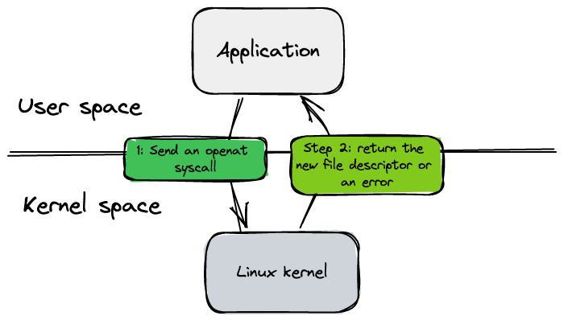
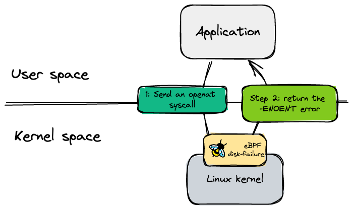

# Disk failure

## Context & Motivation

<p align="center">
    <kbd>
        
    </kbd>
</p>

An application exchanges with the operating system via syscall. The kernel receives calls, process them and return a result or an error for each of them.
In order to open a file, the application needs to send an openat syscall to the kernel. This signal is processed by the kernel, and it returns to the application a new file descriptor or an error.
If a file does not exist, the kernel returns an `-ENOENT` error code. 
The idea, is to simulate this behavior by catching this signal before the kernel and return this error code. This solution does not alert file system and no needs to change the code of the application or kernel. 

## Current Features

<p align="center">
    <kbd>
        
    </kbd>
</p>

The `diskFailure` disruption runs an eBPF program used to intercept system calls and inject errors. It is used to prevent certain processes from accessing certain files. It defines a target process and a filter path, and if the process is trying to open a file that matches the filter path, an -ENOENT error will be injected, preventing the process from opening the file.

The Linux kernel provides an eBPF framework that allows users to load and run custom programs within the kernel of the operating system.
That means it can extend or even modify the way the kernel behaves. It is useful for observability, security, chaos, etc...
With eBPF it is possible to catch openat syscall and override the result with a `-ENOENT` error code.

The disruption has the following additional field:
* **Path**: Prefix used to filter `openat` system calls by path. Does not support wildcard and cannot exceed `62` characters due to eBPF kernel limitation. A validation is in place to avoid the usage of a path greater than this limit.

Support two kind of levels:
* **Node**: Intercept all `openat` system calls of nodes matching the selector.

> Valid disruption

```yaml
---
apiVersion: chaos.datadoghq.com/v1beta1
kind: Disruption
metadata:
  name: example
  namespace: example
spec:
  level: node
  selector:
    app: example
  count: 1
  diskFailure:
    path: /sub/path
```

> Invalid disruption

```yaml
---
apiVersion: chaos.datadoghq.com/v1beta1
kind: Disruption
metadata:
  name: example
  namespace: example
spec:
  level: node
  selector:
    app: example
  count: 1
  diskFailure:
    path: / # <----- Denied!
```

To allow the `"/"` path, the safe-mode has to be disabled. :warning: This is not recommended at all


```yaml
---
apiVersion: chaos.datadoghq.com/v1beta1
kind: Disruption
metadata:
  name: example
  namespace: example
spec:
  level: node
  selector:
    app: example
  count: 1
  unsafeMode:
    DisableDiskFailurePath: true
  diskFailure:
    path: / # <----- Allowed
```

* **Pod**: Intercept all `openat` system  calls of the main process of the containers and its children. Allow to filter by container name too:

> Disrupt all containers

```yaml
---
apiVersion: chaos.datadoghq.com/v1beta1
kind: Disruption
metadata:
  name: example
  namespace: example
spec:
  level: pod
  selector:
    app: example
  count: 1
  diskFailure:
    path: /
```

> Disrupt a single container

```yaml
---
apiVersion: chaos.datadoghq.com/v1beta1
kind: Disruption
metadata:
  name: example
  namespace: example
spec:
  level: pod
  selector:
    app: example
  count: 1
  containers: # only target the dummy container, you can specify multiple containers here (all containers are targeted by default)
    - container-1
  diskFailure:
    path: /
```

## Notes

* The source code of the eBPF disk failure program is [here](../ebpf/disk-failure). 
* Tested with Ubuntu 22.10, kernel 5.15, go 1.19
* To know how to create an eBPF disruption you can refer to the following [documentation](ebpf_disruption.md).
* Be sure to have a kernel build with eBPF:

```shell
CONFIG_BPF=y
CONFIG_HAVE_EBPF_JIT=y
CONFIG_ARCH_WANT_DEFAULT_BPF_JIT=y
CONFIG_BPF_SYSCALL=y
CONFIG_BPF_JIT=y
CONFIG_BPF_JIT_ALWAYS_ON=y
CONFIG_BPF_JIT_DEFAULT_ON=y
CONFIG_BPF_UNPRIV_DEFAULT_OFF=y
CONFIG_BPF_LSM=y
CONFIG_CGROUP_BPF=y
CONFIG_IPV6_SEG6_BPF=y
CONFIG_NETFILTER_XT_MATCH_BPF=m
CONFIG_BPFILTER=y
CONFIG_BPFILTER_UMH=m
CONFIG_NET_CLS_BPF=m
CONFIG_NET_ACT_BPF=m
CONFIG_BPF_STREAM_PARSER=y
CONFIG_LWTUNNEL_BPF=y
CONFIG_BPF_EVENTS=y
CONFIG_BPF_KPROBE_OVERRIDE=y
CONFIG_TEST_BPF=m
```
