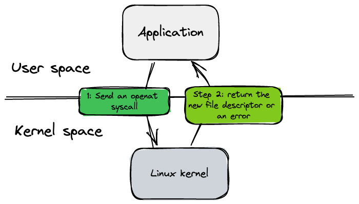
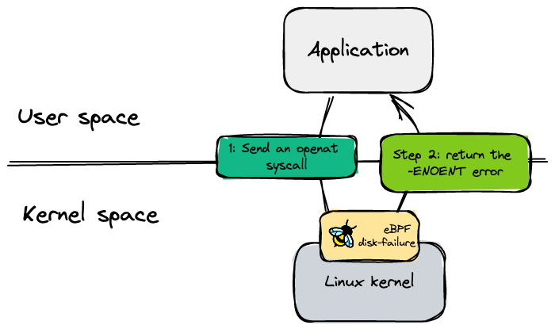
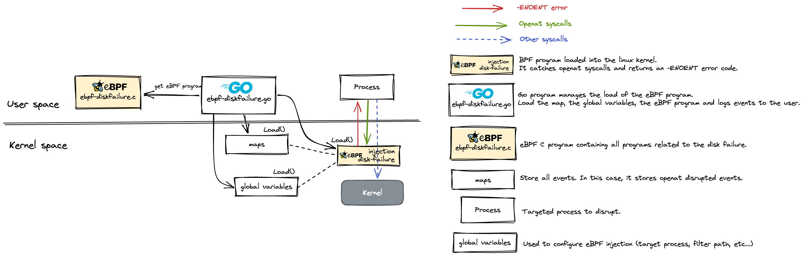

# Disk failure

## Context & Motivation

<p align="center">
    <kbd>
        
    </kbd>
</p>

An application exchanges with the operating system via syscall. The kernel receives calls, processes them and returns a result or an error for each of them.
In order to open a file, the application needs to send an openat syscall to the kernel. This signal is processed by the kernel, and it returns to the application a new file descriptor or an error.
If a file does not exist, the kernel returns an `-ENOENT` error code. 
The idea, is to simulate this behavior by catching this signal before the kernel and return this error code. This solution does not alert file system and no needs to change the code of the application or kernel. 

## Current Features

<p align="center">
    <kbd>
        
    </kbd>
</p>

The `diskFailure` disruption runs an eBPF program used to intercept system calls and inject errors. It is used to prevent certain processes from accessing certain files. It defines a target process and a filter path, and if the process is trying to open a file that matches the filter path, an -ENOENT error will be injected, preventing the process from opening the file.

**Process targeting** is done by matching the target container's PID namespace inode (`/proc/<pid>/ns/pid`). Every process in a container shares the same PID namespace inode, so the entire process tree is targeted regardless of depth — not just the root process and its direct children. At node level, the PID namespace filter is disabled and all processes on the node are targeted.

**Path targeting** intercepts both absolute paths (e.g. `/data/config`) and relative paths resolved via `AT_FDCWD` (e.g. `open("config.yaml", ...)`). Relative paths are resolved to their absolute equivalent by walking the task's working directory dentries, so the same prefix filter applies to both.

The Linux kernel provides an eBPF framework that allows users to load and run custom programs within the kernel of the operating system.
That means it can extend or even modify the way the kernel behaves. It is useful for observability, security, chaos, etc...
With eBPF it is possible to catch openat syscall and override the result with a `-ENOENT` error code.

The disruption has the following additional field:
* **Paths**: Prefix used to filter `openat` system calls by path. Does not support wildcard and cannot exceed `62` characters due to eBPF kernel limitation. A validation is in place to avoid the usage of a path greater than this limit. It is possible to define multiple paths. 
* **Probability**: Define a percentage of failures. Default value: **100%**. It should be a percentage within the range of 1% to 100%.  For example, a Probability field set to 80% will disturb 80% of syscalls by paths.

Support two kind of levels:
* **Node**: Intercept all `openat` system calls of nodes matching the selector.

> Valid disruption

```yaml
---
apiVersion: chaos.datadoghq.com/v1beta1
kind: Disruption
metadata:
  name: example
  namespace: example
spec:
  level: node
  selector:
    service: example
  count: 1
  diskFailure:
    paths:
      - /sub/path
    probability: 100%
```

> Invalid disruption

```yaml
---
apiVersion: chaos.datadoghq.com/v1beta1
kind: Disruption
metadata:
  name: example
  namespace: example
spec:
  level: node
  selector:
    service: example
  count: 1
  diskFailure:
    paths: 
      - / # <----- Denied!
    probability: 100%
```

To allow the `"/"` path, the safe-mode has to be disabled. :warning: This is not recommended at all


```yaml
---
apiVersion: chaos.datadoghq.com/v1beta1
kind: Disruption
metadata:
  name: example
  namespace: example
spec:
  level: node
  selector:
    service: example
  count: 1
  unsafeMode:
    AllowRootDiskFailure: true
  diskFailure:
    paths: 
      - / # <----- Allowed
    probability: 100%
```

* **Pod**: Intercept all `openat` system calls for the entire process tree of the targeted containers (matched via PID namespace inode — grandchildren are targeted too). Containers that share the host PID namespace are rejected at injection time. Filtering by container name is supported:

> Disrupt all containers

```yaml
---
apiVersion: chaos.datadoghq.com/v1beta1
kind: Disruption
metadata:
  name: example
  namespace: example
spec:
  level: pod
  selector:
    service: example
  count: 1
  diskFailure:
    paths: 
      - /
    probability: 100%
```

> Disrupt a single container

```yaml
---
apiVersion: chaos.datadoghq.com/v1beta1
kind: Disruption
metadata:
  name: example
  namespace: example
spec:
  level: pod
  selector:
    service: example
  count: 1
  containers: # only target the dummy container, you can specify multiple containers here (all containers are targeted by default)
    - container-1
  diskFailure:
    paths: 
      - /
    probability: 100%
```

### Override exit code

It is possible to override the exit code of the `openat` syscall with the following spec:

```yaml
---
apiVersion: chaos.datadoghq.com/v1beta1
kind: Disruption
metadata:
  name: example
  namespace: example
spec:
  level: pod
  selector:
    service: example
  count: 1
  containers: # only target the dummy container, you can specify multiple containers here (all containers are targeted by default)
    - container-1
  diskFailure:
    paths: 
      - /
    probability: 100%
    openat:
      exit_code: EACCES # <-- Override the exit code by EACCES. Default: ENOENT
```

List of allowed exit codes:
- EACCES
- EDQUOT
- EEXIST
- EFAULT
- EFBIG
- EINTR
- EISDIR
- ELOOP
- EMFILE
- ENAMETOOLONG
- ENFILE
- ENODEV
- ENOENT
- ENOMEM
- ENOSPC
- ENOTDIR
- ENXIO
- EOVERFLOW
- EPERM
- EROFS
- ETXTBSY
- EWOULDBLOCK

To know more about exit codes you can refer to this [page](https://linux.die.net/man/2/open) in the section `Errors` bellow `Return Value`.

## eBPF Architecture

<p align="center">
    <kbd>
        
    </kbd>
</p>

## Notes

* The source code of the eBPF disk failure program is [here](../ebpf/disk-failure)
* Tested with Ubuntu 22.10, kernel 5.15, go 1.19
* To know how to create an eBPF disruption you can refer to the following [documentation](ebpf_disruption.md)
* :warning: Be sure to have a kernel built with eBPF and `fmod_ret` support:

```shell
# Core eBPF (required by all eBPF disruptions)
CONFIG_BPF=y
CONFIG_BPF_SYSCALL=y
CONFIG_BPF_JIT=y
CONFIG_HAVE_EBPF_JIT=y
CONFIG_NET_CLS_ACT=y

# Required specifically for disk failure (fmod_ret hook)
# The eBPF program uses fmod_ret to intercept openat — this requires
# error-injectable function support in the kernel.
# CONFIG_BPF_KPROBE_OVERRIDE is no longer needed.
CONFIG_FUNCTION_ERROR_INJECTION=y
```

> **Note:** `CONFIG_FUNCTION_ERROR_INJECTION` replaces the previously documented `CONFIG_BPF_KPROBE_OVERRIDE` requirement. The disk failure injector now uses `fmod_ret` (a BTF-based return-value override hook) instead of the older `kprobe + bpf_override_return` approach. Kernels that satisfy the network disruption eBPF requirements but lack `CONFIG_FUNCTION_ERROR_INJECTION` will pass the common eBPF check but be rejected specifically when a disk failure injection is attempted.
