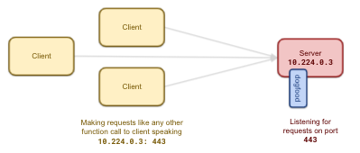
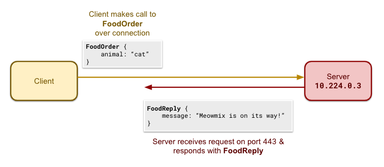
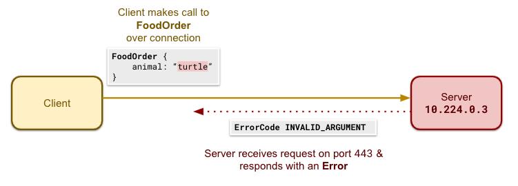
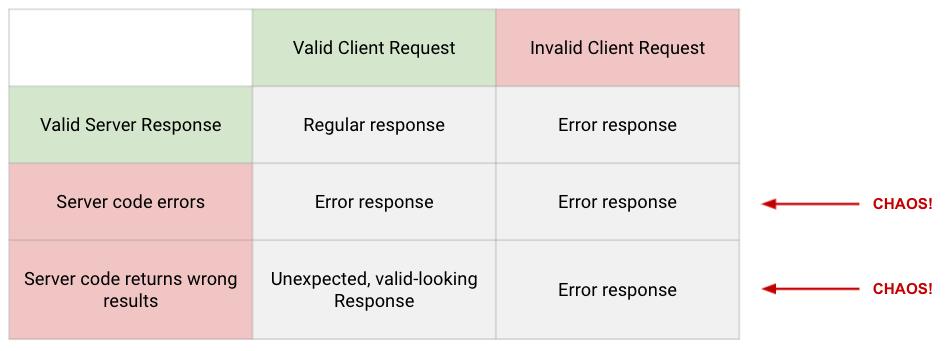

# GRPC disruption

The `grpc` field offers a way to inject invalid DNS records:

* `port` is the port exposed on target pods (the target pods are specified in `spec.selector`)
* `endpoints` is a list of endpoints to alter (a spoof configuration is referred to as an `alteration`)
  * `<endpoints[i]>.endpoint` indicates the fully qualified api endpoint to override (ex: `/chaos_dogfood.ChaosDogfood/getCatalog`)
  * Exactly one of `<endpoints[i]>.error` or `<endpoints[i]>.override` should be defined per endpoint alteration, and the only override currently supported is `{}` which returnes `emptypb.Empty`
  * `<endpoints[i]>.query_pct` defines (out of 100) how frequently this alteration should occur; you may have multiple alterations per endpoint, but you cannot specify a sum total of more than 100 percent for any given endpoint

## How does it work?

A gRPC server can have any number of "services" (each generated by a proto file) registered to it. Some number of server instances usually host a larger number of clients.

    <kbd>
        
    </kbd>

A system failure may be hard to detect.

Imagine this gRPC request response pairing of a successful gRPC call:
* A gRPC client makes call to `/chaos_dogfood.ChaosDogfood/FoodOrder` over the gRPC connection with message `FoodOrder { animal: “cat” }`.
* A gRPC server returns `FoodReply { message: “Meowmix is on its way!” }`.

 

    <kbd>
        
    </kbd>

It is unclear from the outside if the input values were correct for the work the system was trying to do. And it is not obvious whether the response is expected for this input or not by the designer of the system. Does the owner really own a `cat`, or did they mean `dog`? Did the owner expect Meowmix, or was the `ChaosDogfoodService` actually supposed to return Purina for cats?

Now imagine this unsuccessful gRPC call:
* A gRPC client makes call to `/chaos_dogfood.ChaosDogfood/FoodOrder` over the gRPC connection with message `FoodOrder { animal: “cat” }`.
* A gRPC server returns an error with code `INVALID_ARGUMENT`

    <kbd>
        
    </kbd>

Here, it is unclear if the error code returned

    <kbd>
        
    </kbd>

ALGORITHM link