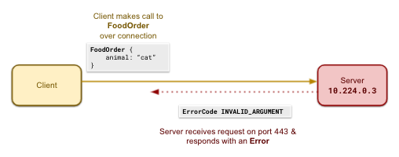

# GRPC disruption

The `grpc` field offers a way to inject spoofed gRPC responses on the server-side. To get this disruption to work, you must apply some code changes to the instantiation of your gRPC server.

* `port` is the port exposed on target pods (the target pods are specified in `spec.selector`)
* `endpoints` is a list of endpoints to alter (a spoof configuration is referred to as an `alteration`)
  * `<endpoints[i]>.endpoint` indicates the fully qualified api endpoint to override (ex: `/<package>.<service>/<method>`)
  * Exactly one of `<endpoints[i]>.error` or `<endpoints[i]>.override` should be defined per endpoint alteration, and the only override currently supported is `{}` which returns `emptypb.Empty`
  * `<endpoints[i]>.query_pct` defines (out of 100) how frequently this alteration should occur; you may have multiple alterations per endpoint, but you cannot specify a sum total of more than 100 percent for any given endpoint

Note: At this time, Chaos Controller does not support:
* disrupting gRPC Streams
* chaining the disruption interceptor on another interceptor you already have
* adding latency
* returning a valid response other than `emptypb.Empty`

## Current User Features

You can disrupt any number of endpoints on a server through this disruption. You can also apply up to 100 disruptions per endpoint (not recommended as this isn't a realistic usecase) and specify what percentage of the requests should be affected by each alteration. You cannot configure the disruption to have percentage requirements which total over 100%, and if you do not include percentages, the Chaos Controller does its best to split the unclaimed portion of requests equally across your different desired alterations.

## Motivation

A gRPC server can have any number of "services" (each generated by a proto file) registered to it. Some number of server instances usually host a larger number of clients. In this section explains the complexity of failure modes involved in application to application communication.

    <kbd>
        
    </kbd>

### A system failure may be hard to detect

Consider this gRPC request response pairing of a successful gRPC call:
* A gRPC client makes call to `/chaos_dogfood.ChaosDogfood/FoodOrder` over the gRPC connection with message `FoodOrder { animal: "cat" }`.
* A gRPC server returns `FoodReply { message: “Meowmix is on its way!” }`.

It is unclear from the outside if the input values were correct for the work the system was trying to do. And it is not obvious whether the response is expected for this input or not by the designer of the system. Does the owner really own a `cat`, or did they mean `dog`? Did the owner expect Meowmix, or was `ChaosDogfoodService` actually supposed to return Purina for cats? Is the `ChaosDogfoodService`actually out of Meowmix and failed to communicate that?

 

    <kbd>
        
    </kbd>

Now consider this gRPC call which returns an error:
* A gRPC client makes call to `/chaos_dogfood.ChaosDogfood/FoodOrder` over the gRPC connection with message `FoodOrder { animal: “cat” }`.
* A gRPC server returns an error with code `INVALID_ARGUMENT`

Here, it is also unclear from the outside if the error code returned is the correct error or if it's masking an underlying issue. It is also not immediately clear which side produced the error.

    <kbd>
        
    </kbd>

For a single endpoint, there are many things that can go wrong. The below table summarizes just some of them. It is not exhaustive from a chaos engineering standpoint. For example we are not considering scenarios outside the state of client in the server such as node failures, network degradation et cetera. The server should be able to detect these issues and surface them to the client through error codes, and therefore these external failures are captured by `Failure` items in the broad `Unexpected error` category.

    <kbd>
        
    </kbd>

**Note:** if the code either returns the expected response when it should not, or the client has no way of knowing it is incorrect, all of those queries will show up as healthy on an alerting dashboard. Clients must also be able to handle expected and unexpected errors well. Finally, if a team decides to deploy a backwards incompatible change and the client never actioned this update, the server may intentionally return an error to signal that the migration has taken place even if the client had the correct response structure.

## Disruption Design OVerview

As the owner of a gRPC service, it can be difficult to investigate what sorts of failures clients are prepared for, but it is both parties' responsibilities to ensure that servers and clients handle failure gracefully and observably. By running disruptions, teams can identify their strengths and weaknesses.

Currently, our disruption allows you to spoof the responses to gRPC requests with one of two alterations: return a gRPC error (e.g. `NOT_FOUND`, `PERMISSION_DENIED`) or return an override (currently just `{}` which tells the server to return `emptypb.Empty`). Chaos Controller does this by leveraging gRPC interceptors.

    <kbd>
        
    </kbd>

You can configure an interceptor function when you bring up the server to handle the request on the server’s behalf and return a response. Because it is a function, you can:
* decide whether to make the actual service call at all
* decide whether you want to mangle the request before the call or mangle the response after the service call.

    <kbd>
        
    </kbd>

In our case, we do not make a service call if the request is one which the disruption_listener is configured to spoof, and instead return a canned response. The disruption begins when you apply a manifest to Kuberenetes with a gRPC disruption for this particular service. The disruption_listener is always checking for requests to disrupt the server to which it is registered. By creating an injector pod that acts as a client on the disruption_listener, Chaos Controller sends its expectations to the server and the server configures the interceptor to spoof requests. The disruption stops when you delete this manifest through the same communication channel (a kill signal to the injector executes its clean command which resets the interceptor to let all queries pass through).

**Note:** To eliminate performance concerns, we recommend you put this interceptor behind a feature flag to (see FAQs for more information).

# FAQs

* [How do I setup a disruption listener service on my gRPC server?](/docs/grpc_disruption/setup_instructions.md)
* [How does the disruption listener service configure the interceptor?](/docs/grpc_disruption/interceptor_algorithm.md)
