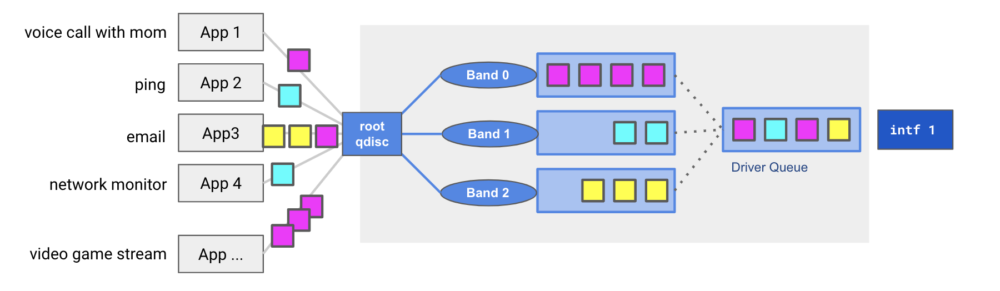
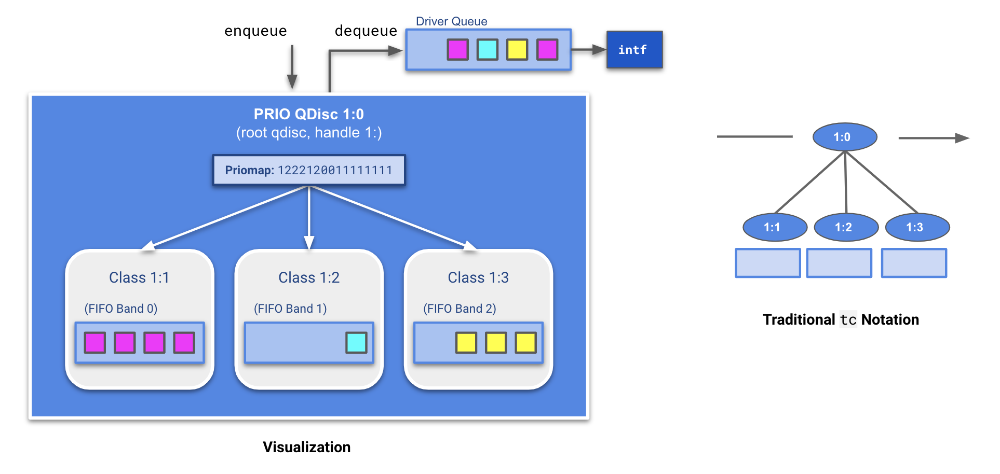
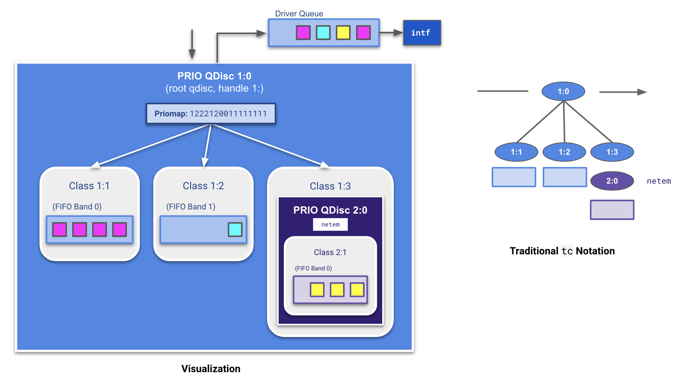
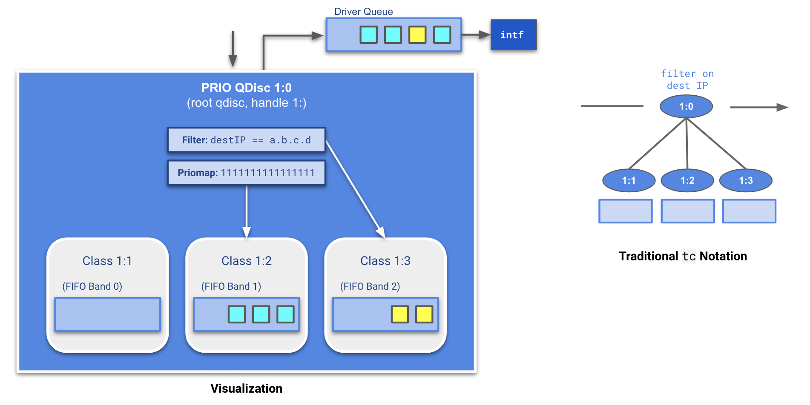

# Network disruption

The `network` field provides an automated way of adding disruptions to the outgoing network traffic:

* `drop` drops a percentage of the outgoing traffic to simulate packets loss
* `corrupt` corrupts a percentage of the outgoing traffic to simulate packets corruption
* `delay` adds the given delay (with +- jitter) to the outgoing traffic to simulate a slow network
* `bandwidthLimit` limits the outgoing traffic bandwidth to simulate a bandwidth struggle

All of them can be combined in the same disruption resource. To apply these disruptions, the `tc` utility is used and the behavior is different according to the use cases.

## FAQs:

* [How do I decide my traffic flow? (Ingress vs Egress)](/docs/network_disruption_flow.md)
* [What should I specify in hosts?](/docs/network_disruption_hosts.md)

## Implementation details

### Building blocks: `prio` qdisc overview

<p align="center"><kbd>
    
</kbd></p>

The `prio` qdisc is a queuing discipline used to define Quality of Service (QoS) on the outgoing traffic. By default, a `prio` qdisc has 3 bands. A priority map spreads the traffic across those 3 bands depending on its criticality as indictaed in the IP packet. `Band 0` is always drained before dequeuing `Band 1`, and `Band 1` is drained before dequeing `Band 2`. More information about this can be found on the [official tc-prio documentation](https://linux.die.net/man/8/tc-prio). 

<p align="center"><kbd>
    
</kbd></p>

Each of these bands is managed by a class which can contain a queue of packets or another qdisc. Attaching a qdisc to a class which is itself part of another qdisc is called chaining. We can use this mechanism to apply network disruptions on a specific band with tools such as [netem](https://wiki.linuxfoundation.org/networking/netem) or [tbf](https://linux.die.net/man/8/tc-tbf). Using `tc`, these disruptions can be applied to qdiscs as rules!

#### Technique 1: chaining disruptions

<p align="center"><kbd>
    
</kbd></p>

We can created a qdisc `2:0` in class `1:3` and apply a `netem` rule to the handle (for example to delay all packets), so any packets that already get sent to `Band 3` now get disrupted.

#### Technique 2: attaching filters

<p align="center"><kbd>
    
</kbd></p>

We can also control traffic through attaching filters to the handle. Here, we attach a filter to handle `1:` which routes all traffic with destination IP `a.b.c.d` to `Band 2`. For illustrative purposes, we also set the underlying priomap to `1111111111111111` which guides all other traffic to class `1:2` (`Band 1`). We can also filter on protocol, source port, and destination port, all of which `chaos-controller` leverages.

### Network Disruption implementation

In the chaos-controller... `// explain how we combine these techniques`


**TODO: rework these two sections**

```

It means that the qdiscs will be created directly from each interface `root` parent and chained together.

eth0
+------------+            +----------+
|parent: root|            |parent: 1 |
|handle: 1   +----------->+handle: 2 |
|qdisc: netem|            |qdisc: tbf|
+------------+            +----------+

eth1
+------------+            +----------+
|parent: root|            |parent: 1 |
|handle: 1   +----------->+handle: 2 |
|qdisc: netem|            |qdisc: tbf|
+------------+            +----------+

It is the most common and simplest usage of `tc`.

### Case 2: One or multiple hosts are specified

If at least one host is specified in the network disruption, the injector has to deal with `tc` filters to avoid to apply the disruptions on all the traffic. In this case, a `prio` qdisc will be created from the root parent of the interface used to send traffic to the specified host(s). Other qdiscs will be chained to the `prio` qdisc. Finally, a filter will redirect the traffic going to the specified host(s) through the right `prio` qdisc band.

------
What we want to do is to avoid applying network disruptions to all the outgoing traffic, even for a small time, because it can lead to unexpected behavior. To deal with this, we create a 4 bands `prio` qdisc with the default priority map (using only 3 bands). The latest band, the 4th one, is never used until we explicitly ask `tc` to use it. We can start to chain qdiscs on this band and, once everything is chained, create a filter that will send the traffic going to the specified host(s) through this band specifically.

eth0
+------------+            +------------+            +----------+
|parent: root|            |parent: 1:4 |            |parent: 2 |
|handle: 1   +----------->+handle: 2   +----------->+handle: 3 |
|qdisc: prio |            |qdisc: netem|            |qdisc: tbf|
+------------+            +------------+            +----------+

Please note the parent set to `1:4` meaning it is chained to the `prio` qdisc 4th band (once again, each band being managed by a class).
```

## Kernel modules

The injector needs some kernel modules to be enabled to be able to run:

* `sch_netem` for the `tc` network emulator module used to apply packets loss, packets corruption and delay
* `sch_tbf` for the `tc` bandwidth limitation used to apply bandwidth limitation
* `sch_prio` for the `tc` `prio` qdisc creation used to apply disruptions to some part of the traffic only

## More documentation about `tc`

* [tc](https://linux.die.net/man/8/tc)
* [tc-prio](https://linux.die.net/man/8/tc-prio)
* [tc-tbf](https://linux.die.net/man/8/tc-tbf)
* [tc-netem](https://man7.org/linux/man-pages/man8/tc-netem.8.html)
