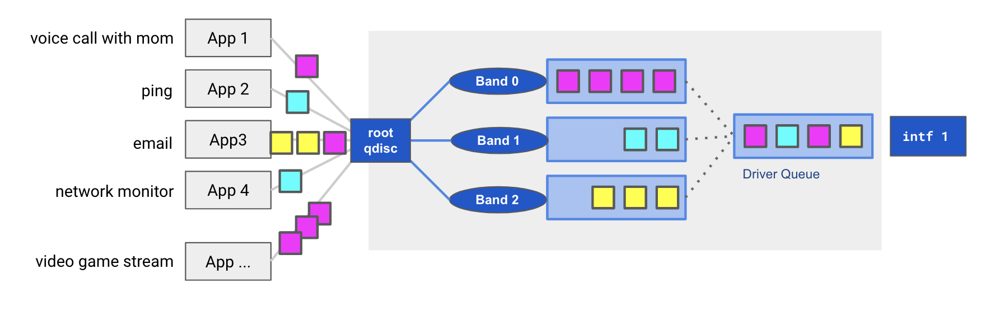
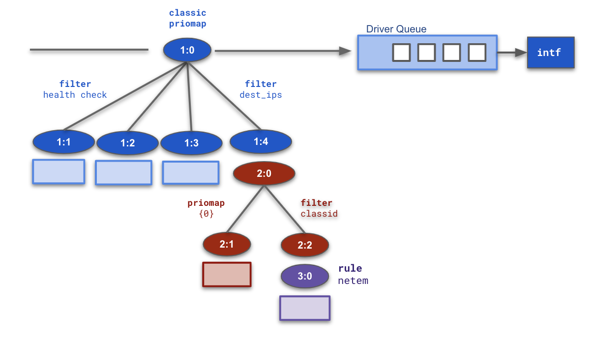
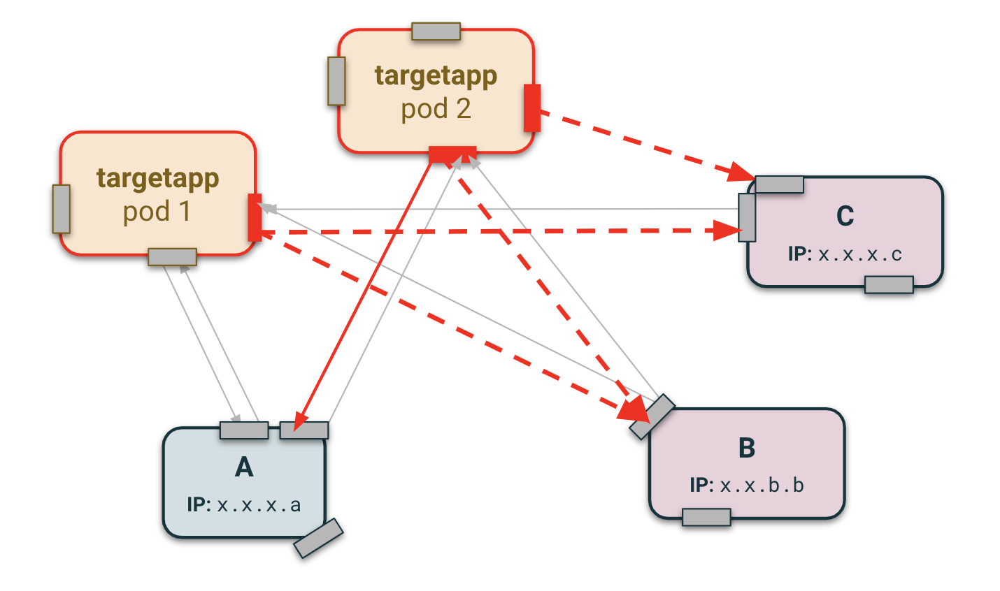

# Network disruption

The `network` field provides an automated way of adding disruptions to network traffic (both egress and ingress):

* `drop` drops a percentage of traffic to simulate packet loss
* `corrupt` corrupts a percentage of traffic to simulate packet corruption
* `delay` adds the given delay to traffic to simulate a slow network
* `delayJitter` adds jitter to `delay` represented as a percentage: `delay ± delay * (delayJitter / 100)`
* `bandwidthLimit` limits traffic bandwidth to simulate a bandwidth struggle

All of them can be combined in the same disruption resource and work for both TCP and UDP on egress and ingress flows. Traffic classification uses a BPF program with an LPM trie for IP/port/protocol matching, while `tc` netem/tbf qdiscs apply the actual disruption effects.

<p align="center"><kbd>
    
</kbd></p>

By extending the default linux kernel functionality for prioritizing network traffic, the `chaos-controller` can disrupt only the packets matching criteria specified in the network disruption spec.

<p align="center">
    <kbd>
        
    </kbd>
    <kbd>
        
    </kbd>
</p>

Even if you do not specify many fields, our default configurations can be effective for most scenarios. However, some disruption scenarios require careful tuning of the specs in order to properly replicate them. 
If your team has specific disruption requirements around what `protocol` to disrupt, `flow` direction, or targeting `hosts`, `ports`, or kubernetes `services`, check out the FAQ pages below to learn more!


## FAQs:

* [How do I decide my traffic flow? (Ingress vs Egress)](/docs/network_disruption/flow.md)
* [What should I specify in hosts vs services?](/docs/network_disruption/hosts-and-services.md)
* [How do I control DNS resolution for hostnames (e.g., bypassing Istio DNS proxy)?](/docs/network_disruption/hosts-and-services.md#case-5-controlling-dns-resolution-with-dnsresolver)
* [What are `prio` qdiscs and how does the chaos-controller use them?](/docs/network_disruption/prio.md)
* [How are changes in destination pods and services filtered on handled by the chaos-controller?](/docs/changes_handling.md#network-disruption-dynamic-service-resolution)

Still have questions? Reach out to the contributors to explore our options!

## Kernel modules

The injector needs some kernel modules to be enabled to be able to run:

* `sch_netem` for the `tc` network emulator module used to apply packets loss, packets corruption and delay
* `sch_tbf` for the `tc` bandwidth limitation used to apply bandwidth limitation
* `sch_prio` for the `tc` `prio` qdisc creation used to apply disruptions to some part of the traffic only
* `sch_ingress` (`CONFIG_NET_SCH_INGRESS`) for the `clsact` qdisc used by the BPF ingress filter
* `ifb` (`CONFIG_IFB`) for the IFB virtual device used for ingress traffic shaping (delay, bandwidth)
* `act_mirred` (`CONFIG_NET_ACT_MIRRED`) for the mirred redirect action used with IFB

## Manual cleanup instructions

:information_source: All those commands must be executed on the infected host (except for `kubectl`).

---

:warning: If the disruption is injected at the pod level, you must enter the pod network namespace first.

* Identify the container IDs of your pod

```
kubectl get -ojson pod demo-curl-547bb9c686-57484 | jq '.status.containerStatuses[].containerID'
"containerd://cb33d4ce77f7396851196043a56e625f38429720cd5d3153cb061feae6038460"
"containerd://629c7da02cbcf77c6b7131a59f5be50579d9e374433a444210b6547186dd5f0d"
```

* For each container, find its pid and its cgroup path

```
# crictl inspect cb33d4ce77f7396851196043a56e625f38429720cd5d3153cb061feae6038460 | grep pid
    "pid": 5607,
            "pid": 1
            "type": "pid"
```

```
# crictl inspect cb33d4ce77f7396851196043a56e625f38429720cd5d3153cb061feae6038460 | grep cgroupsPath
        "cgroupsPath": "/kubepods/burstable/poda37541dc-4905-4a7f-98c0-7d13f58df0eb/cb33d4ce77f7396851196043a56e625f38429720cd5d3153cb061feae6038460",
```

* Enter the network namespace

```
# nsenter --net=/proc/5607/ns/net
```

---

**Clean tc rules**

* Identify impacted interfaces

```
# tc qdisc
qdisc noqueue 0: dev lo root refcnt 2
qdisc prio 1: dev eth0 root refcnt 2 bands 4 priomap 1 2 2 2 1 2 0 0 1 1 1 1 1 1 1 1
qdisc clsact ffff: dev eth0 parent ffff:fff1
qdisc netem 2: dev eth0 parent 1:4 limit 1000 loss 100%
```
*eth0 is affected because it has a netem qdisc and a clsact qdisc with BPF filters attached*

If an IFB device was created for ingress shaping, you may also see:
```
qdisc prio 1: dev ifb-abcd1234 root refcnt 2 bands 4 ...
qdisc netem 2: dev ifb-abcd1234 parent 1:4 limit 1000 delay 100ms
```

* Clear qdisc for impacted interfaces

```
# tc qdisc del dev eth0 root
# tc qdisc del dev eth0 clsact
```

* Delete IFB device if present

```
# ip link del ifb-abcd1234 2>/dev/null
```

* Interface should now have its default qdisc configuration

```
# tc qdisc
qdisc noqueue 0: dev lo root refcnt 2
qdisc noqueue 0: dev eth0 root refcnt 2
```

---

**Clean iptables rules (only needed when HTTP filters are active)**

```
iptables -t mangle -D POSTROUTING -m cgroup --path /kubepods/burstable/poda37541dc-4905-4a7f-98c0-7d13f58df0eb/cb33d4ce77f7396851196043a56e625f38429720cd5d3153cb061feae6038460 -j MARK --set-mark 131074
```

Note: Without HTTP filters, the BPF disruption engine handles all traffic classification. No iptables cgroup marking rules are created.
