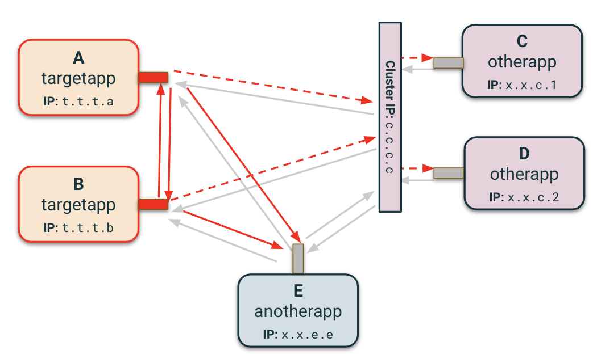

# Network disruption

The `network` field provides an automated way of adding disruptions to the outgoing network traffic:

* `drop` drops a percentage of the outgoing traffic to simulate packet loss
* `corrupt` corrupts a percentage of the outgoing traffic to simulate packet corruption
* `delay` adds the given delay to the outgoing traffic to simulate a slow network
* `delayJitter` adds jitter to `delay` represented as a percentage: `delay ± delay * (delayJitter / 100)`
* `bandwidthLimit` limits the outgoing traffic bandwidth to simulate a bandwidth struggle

All of them can be combined in the same disruption resource. To apply these disruptions, the `tc` utility is used and the behavior is different according to the use cases.

<kbd>
    
</kbd>

By extending the default linux kernel functionality for prioritizing network traffic, the `chaos-controller` can disrupt only the packets matching criteria specified in the network disruption spec.

    <kbd>
        
    </kbd>
    <kbd>
        
    </kbd>

Even if you do not specify many fields, our default configurations can be effective for most scenarios. However, some disruption scenarios require careful tuning of the specs in order to properly replicate them. 
If your team has specific disruption requirements around what `protocol` to disrupt, `flow` direction, or targeting `hosts`, `ports`, or kubernetes `services`, check out the FAQ pages below to learn more!

## FAQs:

* [How do I decide my traffic flow? (Ingress vs Egress)](/docs/network_disruption/flow.md)
* [What should I specify in hosts vs services?](/docs/network_disruption/hosts.md)
* [What are `prio` qdiscs and how does chaos-controller use them?](/docs/network_disruption/prio.md)

Still have questions? Reach out to the contributors to explore our options!

## Kernel modules

The injector needs some kernel modules to be enabled to be able to run:

* `sch_netem` for the `tc` network emulator module used to apply packets loss, packets corruption and delay
* `sch_tbf` for the `tc` bandwidth limitation used to apply bandwidth limitation
* `sch_prio` for the `tc` `prio` qdisc creation used to apply disruptions to some part of the traffic only
