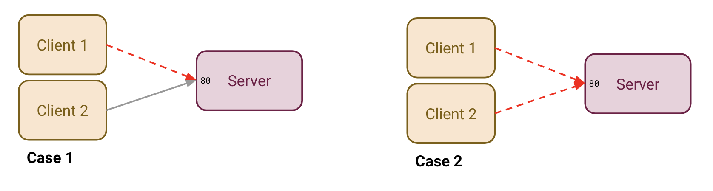
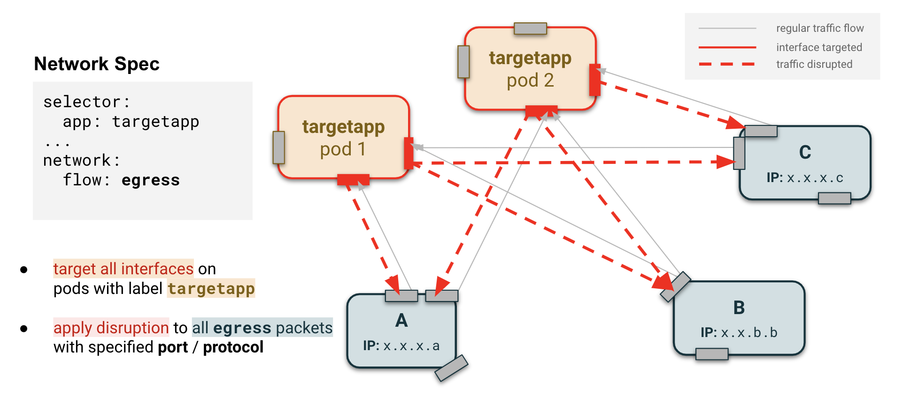
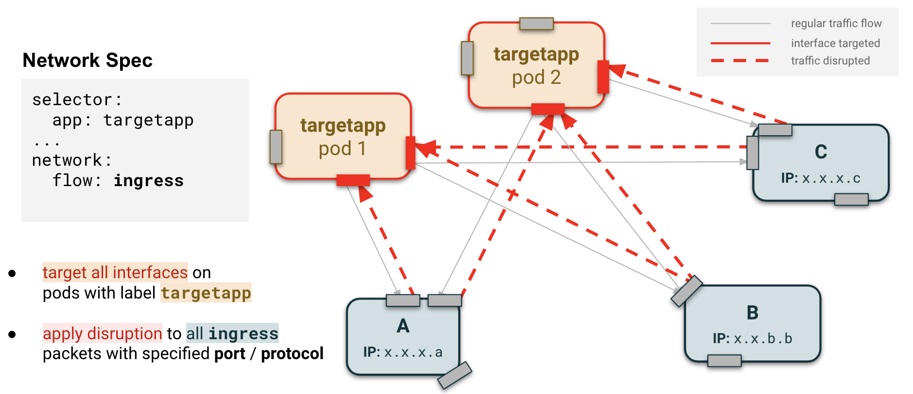
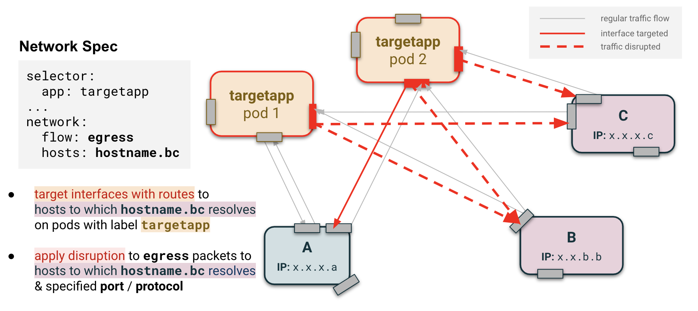

# Network disruption

The `network` field provides an automated way of adding disruptions to the outgoing network traffic:

* `drop` drops a percentage of the outgoing traffic to simulate packets loss
* `corrupt` corrupts a percentage of the outgoing traffic to simulate packets corruption
* `delay` adds the given delay (with +- jitter) to the outgoing traffic to simulate a slow network
* `bandwidthLimit` limits the outgoing traffic bandwidth to simulate a bandwidth struggle

All of them can be combined in the same disruption resource. To apply these disruptions, the `tc` utility is used and the behavior is different according to the use cases.

## Q: Should I use egress or ingress for traffic flow?

The `flow` field allows you to either disrupt outgoing traffic (`egress`) or incoming traffic (`ingress`).

Note the following when using `ingress` (learn more in the next section):
* TCP is the only protocol guaranteed to work
* `ingress` flow should only specifiy `port` and `protocol` fields, not `hosts`

If you are still not sure which one you should use, let's explore a concrete example. Let's say you have 3 pods:
* `server`: an nginx pod listening on 80
* `client1`: a pod hitting nginx on port 80
* `client2`: another pod hitting nginx on port 80

Now let's explore two use cases:

<p align="center"><kbd>
    
</kbd></p>

### Case 1: I want to disrupt `client1` without impacting `client2`

In this case, you want to target the `client1` pod only and use the `egress` flow so you target packets going from the `client1` pod to the `server` pod.

### Case 2: I want to disrupt all clients

In this case, you want to target the `server` pod and use the `ingress` flow so you target all incoming packets from both `client1` and `client2` pods.

## Q: Why are there limitations on `ingress`?

<p align="center"><kbd>
    
</kbd></p>

The current implementation of the `ingress` flow is not a real filter on incoming packets but rather a filter on responses to these packets (ie. outgoing packets). During a TCP communication, when the client sends a packet to the server, the server answers with an acknowledgement packet to confirm that it received the client's packet. By disrupting this acknowledgement packet, it simulates an ingress disruption. As such, the `ingress` flow implementation will not work for UDP unless the server depends on the response packets.

Additionally, the `hosts` field cannot be used reliably with `ingress` flow. 

<p align="center"><kbd>
    
</kbd></p>

For instance, if the nginx service is in a cluster of pods using the host network, the `hosts` field contains the cluster IP, but the source IP field of the packet would have the IP of the specific pod from which the request originated.

<p align="center"><kbd>
    
</kbd></p>

For now, we do not have a solution for resolving to specific pod IPs.

## Q: When should I specificy hosts?

As with all disruptions, pods are targeted for injection if they satisfy the conditions of the label selector specified in the `app` field of `selector`. For network disruptions, we can also specify to only disrupt packets interacting with a particular host or set of hosts through the `hosts` field. Let's see some examples.

### Assumptions

In each of the following cases, it is assumed that any port or protocol filters are always being applied and that packets identified as necessary for healthchecks from the cloud service provider or for communications with Kubernetes are ignored. It is also assumed that interfaces refer to interfaces for pods which pass the requirements of the label selector.

### Case 1: No host is specified

If no host is specified in the network disruption, the disruptions will be applied to all the outgoing (`egress`) or incoming (`ingress`) traffic on all interfaces.

<p align="center"><kbd>
    
</kbd></p>

<p align="center"><kbd>
    
</kbd></p>

### Case 2: CIDR specified

If a CIDR block of one or multiple IP addresses is specified (egress only), the disruptions will be applied to any outgoing traffic on interfaces that contain a route table entry to the specified IP addresses.

<p align="center"><kbd>
    
</kbd></p>

<p align="center"><kbd>
    
</kbd></p>

### Case 3: Hostname specified

Instead of a CIDR, Hostnames can be provided for the `hosts` field. If the chaos-controller fails to resolve the `hosts` field to an IP address or a CIDR block, it tries to resolve the potential hostname on each resolver listed in  `/etc/resolv.conf` in order.

<p align="center"><kbd>
    
</kbd></p>


## Implementation Details

#### Trick of using a `prio` qdisc

The `prio` qdisc is used to define some QoS on the outgoing traffic. By default, a `prio` qdisc has 3 bands (each band being managed by a class) with a priority map spreading the traffic across those 3 bands depending on its criticality. More information about this on the official [tc-prio documentation](https://linux.die.net/man/8/tc-prio).

Because the `prio` qdisc bands are handled by classes, we can chain qdiscs to those classes. It means that we can apply delay on a specific band for instance. What we want to do is to avoid applying network disruptions to all the outgoing traffic, even for a small time, because it can lead to unexpected behavior.

To deal with this, we create a 4 bands `prio` qdisc with the default priority map (using only 3 bands). The latest band, the 4th one, is never used until we explicitly ask `tc` to use it. We can start to chain qdiscs on this band and, once everything is chained, create a filter that will send the traffic going to the specified host(s) through this band specifically.

```
eth0
+------------+            +------------+            +----------+
|parent: root|            |parent: 1:4 |            |parent: 2 |
|handle: 1   +----------->+handle: 2   +----------->+handle: 3 |
|qdisc: prio |            |qdisc: netem|            |qdisc: tbf|
+------------+            +------------+            +----------+
```

Please note the parent set to `1:4` meaning it is chained to the `prio` qdisc 4th band (once again, each band being managed by a class).

## Kernel modules

The injector needs some kernel modules to be enabled to be able to run:

* `sch_netem` for the `tc` network emulator module used to apply packets loss, packets corruption and delay
* `sch_tbf` for the `tc` bandwidth limitation used to apply bandwidth limitation
* `sch_prio` for the `tc` `prio` qdisc creation used to apply disruptions to some part of the traffic only

## More documentation about `tc`

* [tc](https://linux.die.net/man/8/tc)
* [tc-prio](https://linux.die.net/man/8/tc-prio)
* [tc-tbf](https://linux.die.net/man/8/tc-tbf)
* [tc-netem](https://man7.org/linux/man-pages/man8/tc-netem.8.html)


# REPURPOSE
It means that the qdiscs will be created directly from each interface `root` parent and chained together.

```
eth0
+------------+            +----------+
|parent: root|            |parent: 1 |
|handle: 1   +----------->+handle: 2 |
|qdisc: netem|            |qdisc: tbf|
+------------+            +----------+

eth1
+------------+            +----------+
|parent: root|            |parent: 1 |
|handle: 1   +----------->+handle: 2 |
|qdisc: netem|            |qdisc: tbf|
+------------+            +----------+
```

It is the most common and simplest usage of `tc`.

### Case 2: One or multiple hosts are specified

If at least one host is specified in the network disruption, the injector has to deal with `tc` filters to avoid to apply the disruptions on all the traffic. In this case, a `prio` qdisc will be created from the root parent of the interface used to send traffic to the specified host(s). Other qdiscs will be chained to the `prio` qdisc. Finally, a filter will redirect the traffic going to the specified host(s) through the right `prio` qdisc band.
