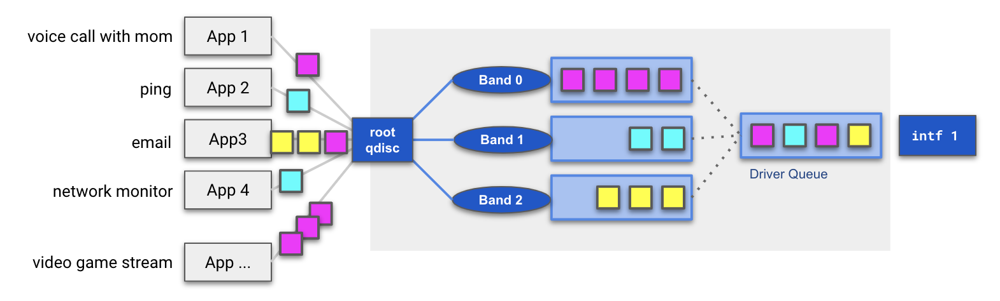

# Network disruption

The `network` field provides an automated way of adding disruptions to the outgoing network traffic:

* `drop` drops a percentage of the outgoing traffic to simulate packet loss
* `corrupt` corrupts a percentage of the outgoing traffic to simulate packet corruption
* `delay` adds the given delay to the outgoing traffic to simulate a slow network
* `delayJitter` adds jitter to `delay` represented as a percentage: `delay ± delay * (delayJitter / 100)`
* `bandwidthLimit` limits the outgoing traffic bandwidth to simulate a bandwidth struggle

All of them can be combined in the same disruption resource. To apply these disruptions, the `tc` utility is used and the behavior is different according to the use cases.

<p align="center"><kbd>
    
</kbd></p>

By extending the default linux kernel functionality for prioritizing network traffic, the `chaos-controller` can disrupt only the packets matching criteria specified in the network disruption spec.

<p align="center">
    <kbd>
        
    </kbd>
    <kbd>
        
    </kbd>
</p>

Even if you do not specify many fields, our default configurations can be effective for most scenarios. However, some disruption scenarios require careful tuning of the specs in order to properly replicate them. 
If your team has specific disruption requirements around what `protocol` to disrupt, `flow` direction, or targeting `hosts`, `ports`, or kubernetes `services`, check out the FAQ pages below to learn more!


## FAQs:

* [How do I decide my traffic flow? (Ingress vs Egress)](/docs/network_disruption/flow.md)
* [What should I specify in hosts vs services?](/docs/network_disruption/hosts.md)
* [What are `prio` qdiscs and how does chaos-controller use them?](/docs/network_disruption/prio.md)

Still have questions? Reach out to the contributors to explore our options!

## Kernel modules

The injector needs some kernel modules to be enabled to be able to run:

* `sch_netem` for the `tc` network emulator module used to apply packets loss, packets corruption and delay
* `sch_tbf` for the `tc` bandwidth limitation used to apply bandwidth limitation
* `sch_prio` for the `tc` `prio` qdisc creation used to apply disruptions to some part of the traffic only

## Manual cleanup instructions

:information_source: All those commands must be executed on the infected host (except for `kubectl`).

---

:warning: If the disruption is injected at the pod level, you must enter the pod network namespace first.

* Identify the container IDs of your pod

```
kubectl get -ojson pod demo-curl-547bb9c686-57484 | jq '.status.containerStatuses[].containerID'
"containerd://cb33d4ce77f7396851196043a56e625f38429720cd5d3153cb061feae6038460"
"containerd://629c7da02cbcf77c6b7131a59f5be50579d9e374433a444210b6547186dd5f0d"
```

* Find one of the container PID

```
# crictl inspect cb33d4ce77f7396851196043a56e625f38429720cd5d3153cb061feae6038460 | grep pid
    "pid": 5607,
            "pid": 1
            "type": "pid"
```

* Enter the network namespace

```
# nsenter --net=/proc/5607/ns/net
```

---

* Identify impacted interfaces

```
# tc qdisc
qdisc noqueue 0: dev lo root refcnt 2
qdisc prio 1: dev eth0 root refcnt 2 bands 4 priomap 1 2 2 2 1 2 0 0 1 1 1 1 1 1 1 1
qdisc prio 2: dev eth0 parent 1:4 bands 2 priomap 0 0 0 0 0 0 0 0 0 0 0 0 0 0 0 0
qdisc netem 3: dev eth0 parent 2:2 limit 1000 loss 100%
```
*eth0 is affected because it has a netem qdisc (it could also have a tbf qdisc depending on the applied disruption)*

* Clear qdisc for impacted interfaces

```
# tc qdisc del dev eth0 root
```

* Interface should now have its default qdisc configuration

```
# tc qdisc
qdisc noqueue 0: dev lo root refcnt 2
qdisc noqueue 0: dev eth0 root refcnt 2
```

---

:warning: If the disruption is injected at the pod level, you must find the related cgroups path **for each container**.

* Identify the container IDs of your pod

```
kubectl get -ojson pod demo-curl-547bb9c686-57484 | jq '.status.containerStatuses[].containerID'
"containerd://cb33d4ce77f7396851196043a56e625f38429720cd5d3153cb061feae6038460"
"containerd://629c7da02cbcf77c6b7131a59f5be50579d9e374433a444210b6547186dd5f0d"
```

* Identify cgroups path

```
# crictl inspect cb33d4ce77f7396851196043a56e625f38429720cd5d3153cb061feae6038460 | grep cgroupsPath
        "cgroupsPath": "/kubepods/burstable/poda37541dc-4905-4a7f-98c0-7d13f58df0eb/cb33d4ce77f7396851196043a56e625f38429720cd5d3153cb061feae6038460",
```

---

* Reset the `net_cls` value for each container

```
# echo 0 > /sys/fs/cgroup/net_cls/kubepods/burstable/poda37541dc-4905-4a7f-98c0-7d13f58df0eb/cb33d4ce77f7396851196043a56e625f38429720cd5d3153cb061feae6038460/net_cls.classid
```
