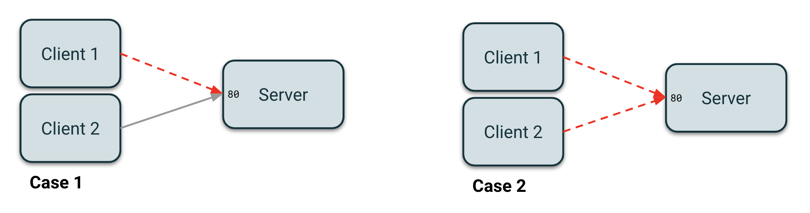

# Network disruption: Traffic Flow

## Q: Should I use egress or ingress for traffic flow?

The `flow` field allows you to either disrupt outgoing traffic (`egress`) or incoming traffic (`ingress`).

Both directions support all disruption types (drop, delay, jitter, bandwidth limit, corruption, duplication) and all protocols (TCP, UDP, ICMP).

If you are still not sure which one you should use, consider the following example. Say you have 3 pods:
* `server`: an `nginx` pod listening on 80
* `client1`: a pod hitting `nginx` on port 80
* `client2`: another pod hitting `nginx` on port 80

Now let us explore two use cases:

<kbd>
    
</kbd>

### Case 1: I want to disrupt `client1` without impacting `client2`

In this case, you want to target the `client1` pod only and use the `egress` flow so you target packets going from the `client1` pod to the `server` pod.

### Case 2: I want to disrupt all clients

In this case, you want to target the `server` pod and use the `ingress` flow so you target all incoming packets from both `client1` and `client2` pods.

You can also use the `hosts` field with `ingress` to target traffic from specific source IPs.

## Q: How does ingress disruption work?

Ingress disruption uses a BPF TC classifier attached to the `clsact` qdisc on the target pod's network interface. The BPF program inspects the **source IP** of incoming packets and matches them against an LPM trie map containing disruption rules.

- **Drop**: The BPF program returns `TC_ACT_SHOT` to drop matched packets (with optional probability via `bpf_get_prandom_u32`).
- **Shaping** (delay, jitter, bandwidth, corruption, duplication): Matched packets are redirected to an IFB (Intermediate Functional Block) virtual device via `bpf_redirect`. The IFB device has a prio/netem/tbf qdisc chain that applies the shaping effects.

This approach:
- Works for **all protocols** (TCP, UDP, ICMP) since it operates at the packet level
- Matches the **real originating pod IP** (not cluster VIPs) since it inspects the packet's source address directly
- Supports **per-host filtering** via the `hosts` field on ingress
- Supports **per-port/protocol filtering** — the `port` and `protocol` fields on hosts are matched in the BPF program after the IP lookup

## Q: How does egress disruption work?

Egress disruption uses the same BPF LPM trie to classify outgoing packets by their **destination IP**. Matched packets are routed to a disruption band in the prio qdisc where netem/tbf apply the disruption effects.

The BPF classifier replaces per-IP tc flower filters, providing:
- **Protocol-agnostic** classification (works for TCP, UDP, and any IP protocol)
- **L4 port/protocol matching** — the `port` and `protocol` fields are checked in the BPF program after the IP lookup
- **Atomic rule updates** when DNS-resolved IPs or service endpoints change (single LPM trie map update instead of per-filter add/delete)
- **CIDR matching** via LPM trie prefix semantics
- **Service endpoint filtering** — Kubernetes service endpoints (both ClusterIP and headless) are resolved to BPF rules and dynamically updated as pods are added/removed

## Q: What about `connState`?

The `connState` field (`new`/`est`) is **not currently supported** with the BPF disruption engine. If specified, a warning is logged and the field is ignored. This may be supported in a future release via `bpf_ct_lookup`.

## Architecture reference

See [ADR-001: Unified BPF Disruption Engine](../decisions/ADR-001-unified-bpf-disruption-engine.md) for the full architectural decision record, alternatives considered, and trade-offs.
