# Network disruption: Specifying hosts and services

## Q: When should I specify hosts?

<p align="center"><kbd>
    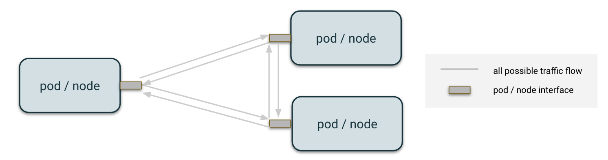
</kbd></p>

As with all disruptions, pods or nodes are targeted for injection if they satisfy the conditions of the label selector specified in the `selector` field. 
For network disruptions, we can also specify to only disrupt packets interacting with a particular host or set of hosts through the `network.hosts` field. We will refer to `network.hosts` field in the rest of the document as the `hosts` field.
The `hosts` field takes a list of `host`/`port`/`protocol`/`connState` tuples. All three fields are optional.

<p align="center"><kbd>
    
</kbd></p>

## Q: When should I specify services instead?

Are you attempting to disrupt traffic to a service in the same kubernetes cluster?

While the `network.hosts` field is meant for specifying only disrupting packets interacting with a particular IP, hostname, or CIDR range,
a very common use case of network disruptions is to disrupt packets interacting with a particular kubernetes service. This can be tricky for users,
as NAT rules are applied before `tc` rules, and thus the port that a pod uses to send packets to a service is not necessarily the same port used by the node in the root network namespace.
It is not simple to detect that a hostname passed to `network.hosts` is a kubernetes service, and thus we include the `network.services` field.

Whenever you want to disrupt traffic interacting with a kubernetes service[s] in the same cluster as your target, for correctness's sake, you _must_ specify the service under `network.services`, rather than `network.hosts`.
`network.services` takes a list of services, which are defined with each service's `name` and `namespace`, as well as a list of `ports` to be affected. 
In this `ports` list, you can specify the `name` of the port and/or the `port` itself ([see kubernetes service definition for context](https://kubernetes.io/docs/concepts/services-networking/service/#defining-a-service)). Those fields (`name`, `port`) are **exclusively used to find the right service port to affect**. 

Example:

You have a service defined here:
```
---
apiVersion: v1
kind: Service
metadata:
  name: demo
  namespace: chaos-demo
spec:
  ports:
    - name: regular-port
      port: 8080
      targetPort: 80
      protocol: TCP
    - name: very-special-port
      port: 8081
      targetPort: 80
      protocol: TCP
  selector:
    app: demo-nginx
```

In order to only affect the service port `regular-port`, you can define in your disruption specs:

```
network:
  services:
    - name: demo
      namespace: chaos-demo
      ports:
        - name: regular-port # optional. This is used to find the right port to be affected in case the service has multiple ports
```

OR

```
network:
  services:
    - name: demo
      namespace: chaos-demo
      ports:
        - port: 8080
```

OR BOTH

```
network:
  services:
    - name: demo
      namespace: chaos-demo
      ports:
        - port: 8080
          name: regular-port
```


The controller will take care of applying `tc` rules in a way that targets any port that may be used to talk to that service. There are no changes to how you should configure this field in a `node` level disruption
vs. a `pod` level disruption.

```
network:
  services:
    - name: service_name
      namespace: example_namespace
      ports:
        - port: 8080 
          name: service_port_name # optional. This is used to find the right port to be affected in case the service has multiple ports
```

### Headless Services

A "headless" service is a ClusterIP service whose ClusterIP is defined as "None". This means that connecting clients 
need to resolve the service's hostname via a separate service resolution system. When a headless service is specified under 
`spec.network.services`, we will resolve the service and block all traffic to all returned endpoints.

## Q: How can I exclude some hosts from being disrupted?

It is sometimes handy to disrupt all packets going to a whole CIDR but excluding some of them. You have two ways to exclude some hosts from being disrupted in a network disruption:
* from the disruption itself, so it applies to this disruption only
* from the controller, so it applies to all network disruptions even when not specified explicitly

### From the disruption

You can specify hosts to exclude in the `allowedHosts` field of a network disruption with the same format as the `hosts` field. [Here's an example illustrating that](../../examples/network_allowed_hosts.yaml).

### From the controller

You can pass a flag to the controller to specify hosts which would be excluded from all disruptions even when not specified in the disruption itself. The flag to use is `--injector-network-disruption-allowed-hosts` and has the same format as the flag passed to the injector container: `<host>;<port>;<protocol>`.

```
--injector-network-disruption-allowed-hosts 10.0.0.1;53;udp
```

It can be configured easily [in the chart values.yaml file](../../chart/values.yaml).

## Q: What are the default excluded hosts?

These can be disabled by setting `network.disableDefaultAllowedHosts: true` in your Disruption's spec.

### Pod level network disruptions

Both of the following safeguards are used to allow the node to communicate with the pod for things like liveness probes.

* to default routes gateways
* to node IP

### Node level network disruptions

* ARP packets (for cloud providers health checks)
* SSH packets
* metadata service (packets going to `169.254.169.154`)

## Notation

Although the `hosts` field is handled in the same way for both pod and node level disruptions, different network interfaces may be targeted based node configurations. For example, pods that have their own networking interface work differently than pods that use their hosts' networking directly:

<p align="center"><kbd>
    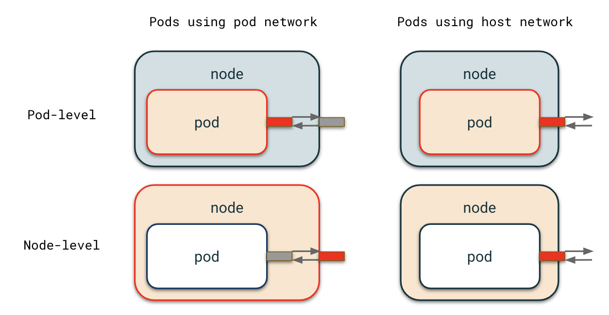
</kbd></p>

For diagrams in this documentation, arrows represent traffic flow from a particular interface to another. They do not represent the entire path a packet takes to arrive at another pod unless an intermediate device or packet alteration affects how the disruption applies.

<p align="center"><kbd>
    
</kbd></p>

Note also that the `flow` (`ingress` vs `egress`) for a disruption should be selected deliberately. Check out [this documentation](/docs/network_disruption/flow.md) for more details!

<p align="center"><kbd>
    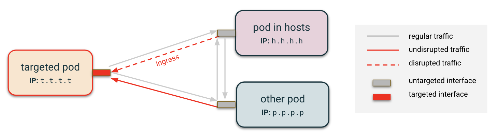
</kbd></p>

### Assumptions

In this document, you can assume that packets identified as necessary for healthchecks from the cloud service provider or for communications with Kubernetes are ignored.

Additionally, note that the `hosts.host` subfield expects an item that need not be of the same type across multiple `hosts` (for example, you can have a hostname, IP address, and CIDR block in one disruption). They are visualized separately in the use cases outlined below to avoid confusion.

See the **Some special cases** section for examples of specifying the `port` and `protocol` subfields.

With these nuances and notations in mind, let us explore some examples.

## Pod Level Examples

<p align="center"><kbd>
    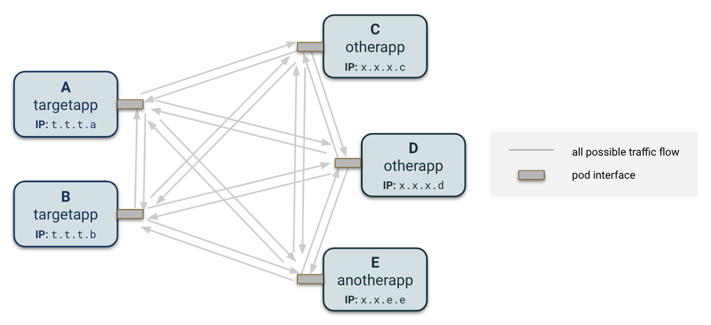
</kbd></p>

A pod typically has a single interface with which it interacts with the outside world. Let's take a set of five pods belonging to three applications, and see how different `hosts` field configurations affect the traffic differently.

### Case 1: No host is specified

<p align="center"><kbd>
    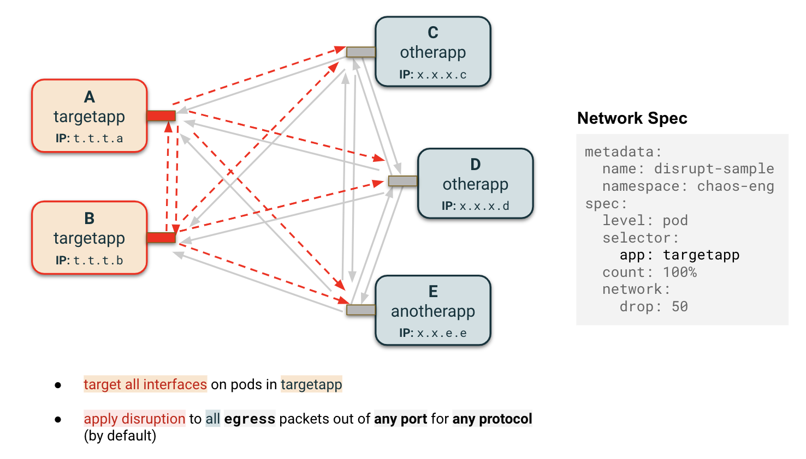
</kbd></p>

<p align="center"><kbd>
    
</kbd></p>

If no `hosts` field is specified, all packets aside from those explicitly whitelisted in the **Assumptions** will be disrupted, in this case dropping 50% of traffic leaving (`egress`) or entering (`ingress`) the interface.

Note: `ingress` traffic disruption is only guaranteed for `TCP`, not `UDP`. See [this documentation](../../docs/network_disruption/flow.md) for more details. For the remainder of this documentation, we will only discuss the default flow configuration (`egress`).

### Case 2: IP address specified

<p align="center"><kbd>
    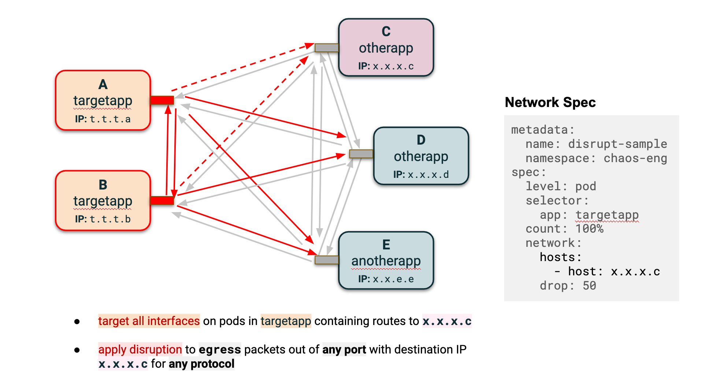
</kbd></p>

<p align="center"><kbd>
    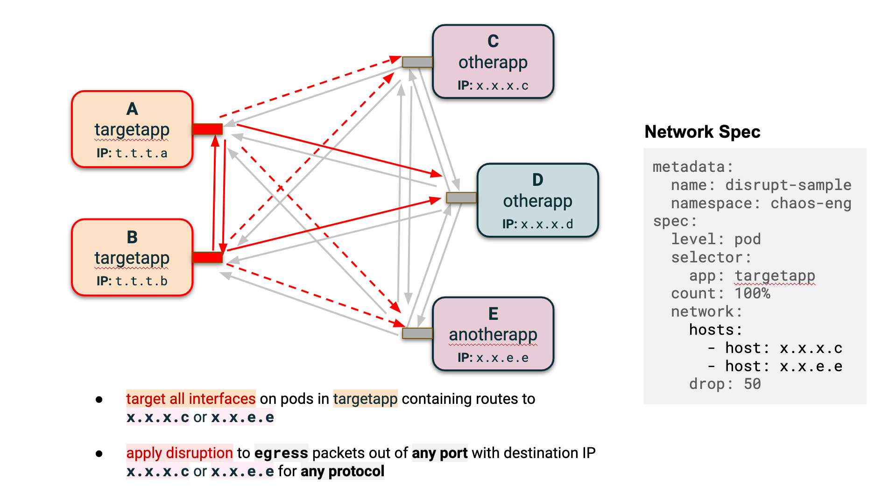
</kbd></p>

If the `hosts` field contains one or multiple IP addresses, the routing table is consulted, and interfaces containing routes to those IPs will get targeted. In the absence of such interface, the default interface gets selected. As discussed above, pods usually have one interface, `eth0`. To explore more nuances around interface selection, check out the Node level examples in the next section.

### Case 3: CIDR block specified

<p align="center"><kbd>
    
</kbd></p>

If the `hosts` field contains a CIDR, the routing table is consulted. If the list of IP addresses in the CIDR block overlaps with IP addresses which comprise the route entries of an interface, then the interface is targeted. In the absence of such interface, the default interface gets selected.

### Case 4: Hostname specified

<p align="center"><kbd>
    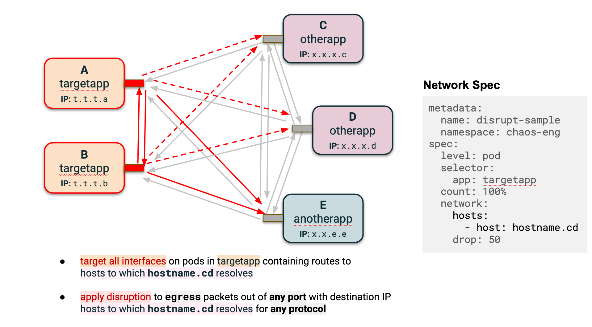
</kbd></p>

Instead of a CIDR block, hostnames can be provided in the `hosts` field. If the `chaos-controller` fails to resolve the `hosts` field to an IP address or a CIDR block, it then tries to resolve the potential hostname on each resolver listed in `/etc/resolv.conf` in order.
Remember, this hostname must _not_ be a kubernetes service's hostname.

### Case 5: Controlling DNS Resolution with `dnsResolver`

When specifying hostnames in the `hosts` or `allowedHosts` fields, you can control which DNS resolver is used to resolve the hostname to an IP address. This is particularly useful in environments with service mesh proxies (like Istio) that intercept DNS queries and return virtual IPs (VIPs) that may not work for traffic disruption. In these cases, you should rely on the node-level resolver to ensure the hostnames resolve to the actual destination IPs rather than the service mesh VIP.

The `dnsResolver` field supports the following strategies:

| Strategy            | Description                                                                        |
|---------------------|------------------------------------------------------------------------------------|
| `pod`               | Uses only the pod's DNS configuration (`/etc/resolv.conf`)                         |
| `node`              | Uses only the node's DNS configuration (`/mnt/host/etc/resolv.conf`)               |
| `pod-fallback-node` | Tries pod DNS first, falls back to node DNS if resolution fails (default behavior) |
| `node-fallback-pod` | Tries node DNS first, falls back to pod DNS if resolution fails                    |

**Example: Bypassing Istio DNS Proxy in `hosts`**

When Istio DNS proxy is enabled, pod-level DNS lookups may return VIP addresses (Class E subnet: 240.0.0.0/4) that don't work for network disruptions. In this case, use `dnsResolver: node` to bypass the Istio proxy and get the actual service IPs:

```yaml
apiVersion: chaos.datadoghq.com/v1beta1
kind: Disruption
metadata:
  name: network-disruption-istio
  namespace: chaos-demo
spec:
  level: pod
  selector:
    app: my-service
  count: 1
  network:
    drop: 50
    hosts:
      - host: external-api.example.com
        port: 443
        protocol: tcp
        dnsResolver: node  # Bypasses Istio DNS proxy, gets real IPs
```

**Example: Using `dnsResolver` with `allowedHosts`**

The `dnsResolver` field is also available for `allowedHosts`, which is useful when you want to exclude specific hosts from disruption but need to control how their hostnames are resolved:

```yaml
apiVersion: chaos.datadoghq.com/v1beta1
kind: Disruption
metadata:
  name: network-disruption-with-exclusions
spec:
  level: pod
  selector:
    app: my-service
  network:
    drop: 100
    allowedHosts:
      - host: critical-internal-service.cluster.local
        port: 443
        protocol: tcp
        dnsResolver: pod  # Use pod DNS for internal service
      - host: monitoring.example.com
        port: 443
        protocol: tcp
        dnsResolver: node  # Use node DNS for external monitoring service
```

**Example: Multiple hosts with different DNS strategies**

```yaml
network:
  drop: 50
  hosts:
    # External service - use node DNS to avoid service mesh VIPs
    - host: external-service.example.com
      port: 443
      protocol: tcp
      dnsResolver: node

    # Internal cluster service - use pod DNS for cluster-internal resolution
    - host: internal-service.cluster.local
      port: 8080
      protocol: tcp
      dnsResolver: pod

    # Public API - use default behavior (pod-fallback-node)
    - host: api.public.com
      port: 443
      protocol: tcp
      # dnsResolver not specified = uses default "pod-fallback-node"
  allowedHosts:
    # Critical dependency that should never be disrupted
    - host: database.internal.example.com
      port: 5432
      protocol: tcp
      dnsResolver: node  # Ensure reliable resolution using node DNS
```

**When to use each strategy:**

- **`node`**: Use when working with service meshes (Istio, Linkerd) that proxy DNS, or when you need to resolve external hostnames using the node's DNS servers (e.g., corporate DNS servers)
- **`pod`**: Use for cluster-internal services or when you specifically want to use the pod's DNS configuration
- **`pod-fallback-node`** (default): Use when you want resilience - try pod DNS first but fall back to node DNS if it fails
- **`node-fallback-pod`**: Use when node DNS is preferred but you want pod DNS as a backup

#### Customizing resolv.conf Paths

By default, the chaos-controller uses these locations for resolv.conf files:

- **Pod DNS**: `/etc/resolv.conf`
- **Node DNS**: `/mnt/host/etc/resolv.conf`

These defaults are set in the controller configuration. Some Kubernetes distributions or node configurations may use different locations for resolv.conf. You can override the defaults using Helm values:

**Helm Configuration:**

Override resolv.conf paths in your Helm values:

```yaml
injector:
  networkDisruption:
    # Path for pod DNS resolv.conf
    # Default: /etc/resolv.conf
    dnsPodResolvConf: "/run/systemd/resolve/resolv.conf"

    # Path for node DNS resolv.conf
    # Default: /mnt/host/etc/resolv.conf
    dnsNodeResolvConf: "/mnt/host/run/systemd/resolve/stub-resolv.conf"
```

**Behavior:**
- Defaults are defined in the controller configuration (can be overridden via ConfigMap, environment variables, or CLI flags)
- The specified resolv.conf file must exist and be readable
- Configuration is passed to injector pods as command-line arguments
- Logging will indicate which resolv.conf file was loaded

**Example: Full Helm configuration for systemd-resolved nodes**

```yaml
# values.yaml
injector:
  networkDisruption:
    hostResolveInterval: 1m

    # For nodes using systemd-resolved (Ubuntu, Debian, etc.)
    dnsNodeResolvConf: "/mnt/host/run/systemd/resolve/stub-resolv.conf"

    # For pods with custom DNS configuration
    dnsPodResolvConf: "/run/systemd/resolve/resolv.conf"
```

**How it works:**

When you deploy with these Helm values:
1. The controller reads the configuration from the ConfigMap
2. For each network disruption, the controller creates an injector pod with CLI arguments:
   ```bash
   /chaos-injector network-disruption \
     --dns-pod-resolv-conf /run/systemd/resolve/resolv.conf \
     --dns-node-resolv-conf /mnt/host/run/systemd/resolve/stub-resolv.conf \
     ...
   ```
3. The injector uses these paths for DNS resolution
4. Logs will show which resolv.conf files were loaded:
   ```
   INFO  loaded pod DNS configuration  resolv_conf_path=/run/systemd/resolve/resolv.conf  nameservers=[8.8.8.8, 8.8.4.4]
   INFO  loaded node DNS configuration  resolv_conf_path=/mnt/host/run/systemd/resolve/stub-resolv.conf  nameservers=[10.0.0.1]
   ```

You can verify the paths used by an injector pod:
```bash
kubectl describe pod chaos-injector-xxxxx -n chaos-engineering | grep dns-
```

**Use cases:**
- **systemd-resolved**: Nodes using systemd-resolved may have resolv.conf at `/run/systemd/resolve/resolv.conf` or `/run/systemd/resolve/stub-resolv.conf`
- **NetworkManager**: Some distributions use `/run/NetworkManager/resolv.conf`
- **Custom Kubernetes distributions**: Distributions like k3s, microk8s, or OpenShift may use non-standard paths
- **Custom DNS configurations**: Environments with custom DNS setups that require specific resolv.conf locations

### Some special cases

Cluster IPs can also be specified to target the relevant pods.

<p align="center"><kbd>
    
</kbd></p>

All of these use cases may have `port` configurations, `protocol` configurations, or both which can be applied on top of the example disruptions. Packets going through the same interface which do not meet those criteria will be delivered as if they were not targeted (some nuance on this in the [tc documentation](../../docs/network_disruption/prio.md)).

<p align="center"><kbd>
    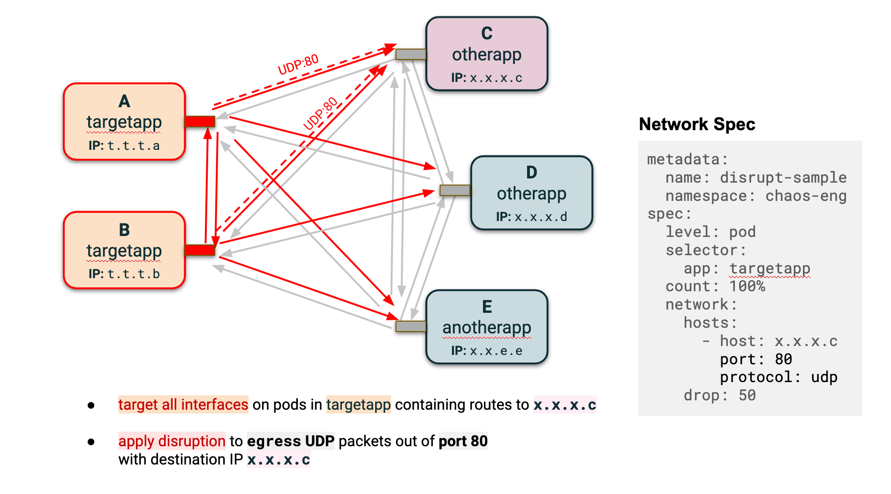
</kbd></p>

<p align="center"><kbd>
    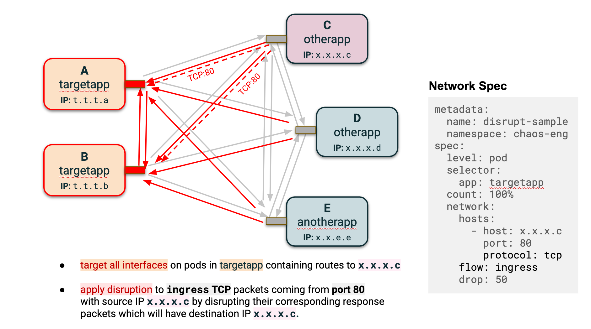
</kbd></p>

## Node Level Examples

Pods usually come with one network interface. This is common for nodes as well, but large nodes can have multiple interfaces to which pods are assigned one-to-many.

<p align="center"><kbd>
    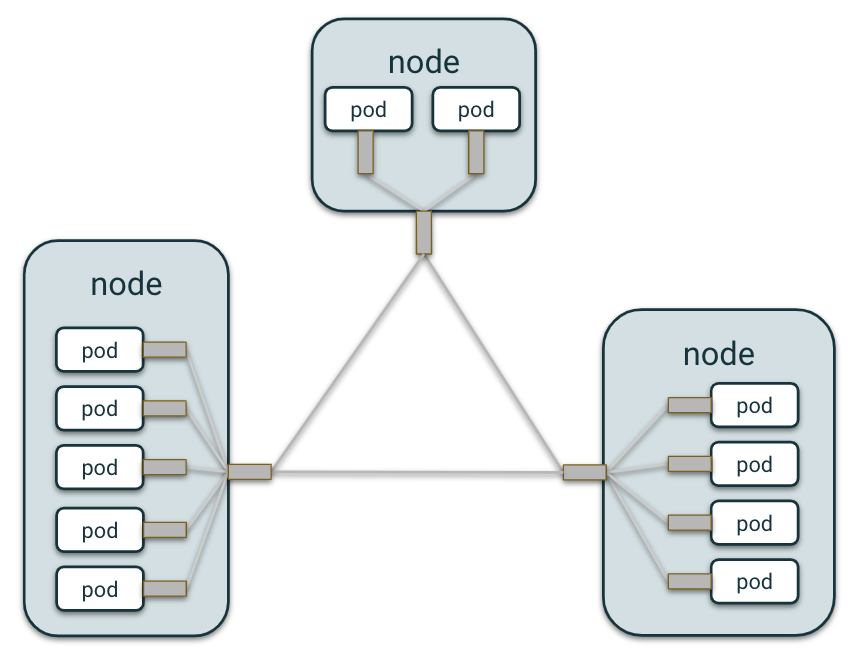
    
</kbd></p>

### Case 1: Label selector for a few nodes

When a node is targeted, all interfaces with route table entries to IP addresses specified in `hosts` (for completeness, this can be through an explicit list of IP addresses, CIDR blocks, hostnames, or some combination of these) will be targeted. As is the case with pods, a `tc` rule is applied which impacts packets with destination IPs satisfying these `hosts` criteria/

<p align="center"><kbd>
    
</kbd></p>

The diagrams thus far seem to imply that all network interfaces have a routing table entry for any pod we wish to disrupt. For nodes with multiple interfaces, it is conceivable and likely that not all interfaces have routing table entries to the specified `hosts`. The `chaos-controller` applies tc rules to all interfaces which it discovers by traversing all routing tables.

### Case 2: Disrupting an entire AZ
Given a label which encompasses all nodes in an Availability Zone, `chaos-controller` can simulate zonal failures for one or more cloud services.

<p align="center"><kbd>
    
</kbd></p>
