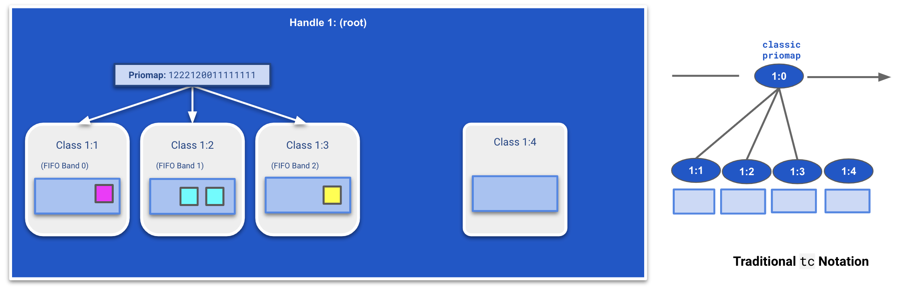
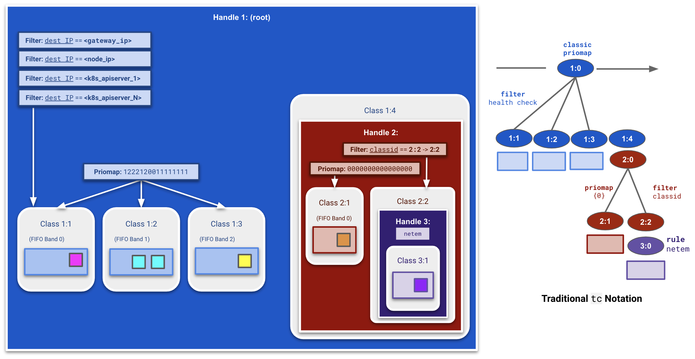
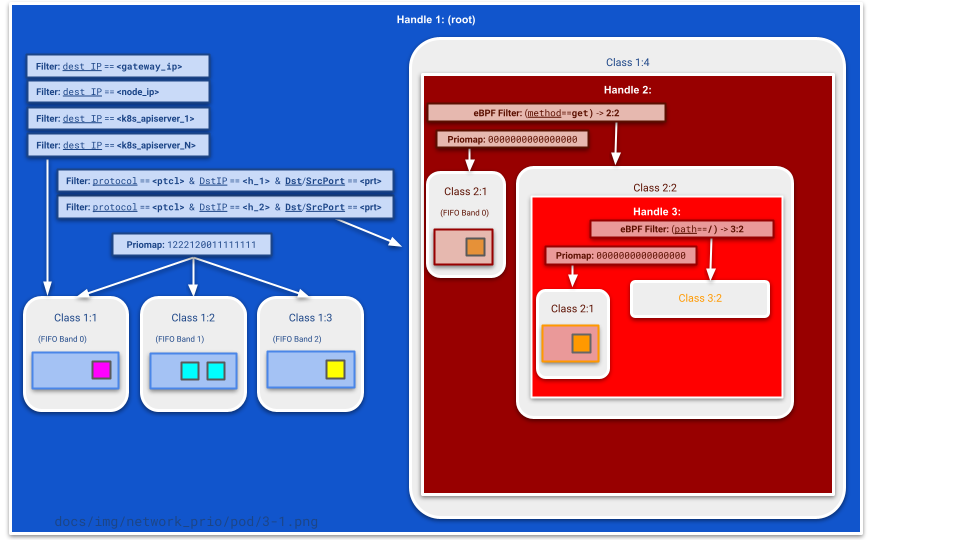

# Network disruption: `tc` and `prio` qdiscs

## Q: How are queuing disciplines leveraged in network disruptions?

### Building blocks: `prio` qdisc overview

<p align="center"><kbd>
    
</kbd></p>

The `prio` qdisc is a queuing discipline used to define Quality of Service (QoS) on the outgoing traffic. By default, a `prio` qdisc has 3 bands. A priority map spreads the traffic across those 3 bands depending on its criticality as indicated in the IP packet. `Band 0` is always drained before dequeuing `Band 1`, and `Band 1` is drained before dequeuing `Band 2`. More information about this can be found on the [official tc-prio documentation](https://linux.die.net/man/8/tc-prio). 

<p align="center"><kbd>
    
</kbd></p>

Each of these bands is managed by a class which can contain a queue of packets or another qdisc. Attaching a qdisc to a class which is itself part of another qdisc is called chaining. We can use this mechanism to apply network disruptions on a specific band with tools such as [netem](https://wiki.linuxfoundation.org/networking/netem) or [tbf](https://linux.die.net/man/8/tc-tbf). Using `tc`, these disruptions can be applied to qdiscs as rules!

#### Technique 1: chaining disruptions

<p align="center"><kbd>
    
</kbd></p>

We can created a qdisc `2:0` in class `1:3` and apply a `netem` rule to the handle (for example to delay all packets), so any packets that already get sent to `Band 3` now get disrupted.

#### Technique 2: attaching filters

<p align="center"><kbd>
    
</kbd></p>

We can also control traffic through attaching filters to the handle. Here, we attach a filter to handle `1:` which routes all traffic with destination IP `a.b.c.d` to `Band 2`. For illustrative purposes, we also set the underlying priomap to `Band 1` (notated here as `{1}`) which guides all other traffic to class `1:2` (`Band 1`). We can also filter on protocol, source port, and destination port, all of which `chaos-controller` leverages.

### Network Disruption implementation

In the chaos-controller, priority mappings, chaining, and filters are combined to create disruptions targeting specific pods or nodes. In this section, we take two sample network disruption specs (one for Node level and one for Pod level) to illustrate the `tc` steps involved.

#### Node level visualization

Let us take the following node level disruption spec:
```
spec:
  level: node
  selector:
    app: demo
  count: 1
  network:
    hosts:
      - 10.0.1.26/32
      - 10.0.1.25/32
    port: 80
    protocol: tcp
    flow: egress
    delay: 1000
    delayJitter: 5
    bandwidthLimit: 5000
```

#### (Step 1) Add a fourth band

<p align="center"><kbd>
    
</kbd></p>

The disruption should only affect packets leaving our target node. On top of the three default bands, chaos-controller creates a fourth band (class `1:4`) to which it will send packets identified as candidates for the disruptions. In this step, the filter on handle `1:` to route traffic to class `1:4` has not been set up. We will see the specific criteria in `Step 3` after setting up the fourth band completely.

#### (Step 2) Disrupt the fourth band

<p align="center"><kbd>
    
</kbd></p>

There are three disruption-related fields specified: `delay`, `delayJitter`, and `bandwidth`. `delay` and `delayJitter` are both `netem` rules and will be applied in one `prio` qdisc attached to class `1:4`.

<p align="center"><kbd>
    
</kbd></p>

Since `bandwidth` requires the Token Buffer Filter (`tbf`) tool, an additional `prio` qdisc with the `tbf` rule applied to it will be chained to class `2:1`. As packets are enqueued to class `1:4`, they will traverse the chains and end up enqueued in class `3:1`, waiting to be dequeued by the classes above them.

#### (Step 3) Divert traffic

Now that the disruption has been setup on the fourth band, we can apply filters to handle `1:` to send packets to the appropriate band.

<p align="center"><kbd>
    
</kbd></p>

We first filter for all packets related to health checks by the cloud provider or SSH to be sent to `Band 0`. We also consult `kubernetes.default` for any Kubernetes apiservers which should not be disrupted.

<p align="center"><kbd>
    
</kbd></p>

Finally, we apply a filter to enqueue all packets to class `1:4` where the `destination IP` is encompassed by the `hosts` field (see [this documentation](../../docs/network_disruption/hosts-and-services.md) for more details). In this case, a filter is applied for `10.0.1.26/32` and another for `10.0.1.25/32`. If no hosts were specified, a single filter is applied for `0.0.0.0/0`. If a CIDR block or hostname is specified, corresponding filters are constructed for all IPs in that range.

### Network Disruption implementation for pod level

Now, let us take the following pod level disruption spec:
```
spec:
  level: pod
  selector:
    app: demo
  count: 1
  network:
    hosts:
      - 10.0.1.254/31
    port: 80
    protocol: tcp
    flow: egress
    delay: 1000
    delayJitter: 5
```

#### (Step 1) Add a fourth band

<p align="center"><kbd>
    
</kbd></p>

The disruption should only affect packets leaving our target node. On top of the three default bands, chaos-controller creates a fourth band (class `1:4`) to which it will send packets identified as candidates for the disruptions. In this step, the filter on handle `1:` to route traffic to class `1:4` has not been set up. We will see the specific criteria in `Step 3` after setting up the fourth band completely.

#### (Step 2)  Disrupt the fourth band for only the traffic originating from specified pods

<p align="center"><kbd>
    
</kbd></p>

To this fourth band, another `prio` qdisc with handle `2:` attached. This qdisc defaults to a priomap routing all traffic to `Band 0` (notated here as `{0}`). This band is a catch-all for packets which do not end up being disrupted.

<p align="center"><kbd>
    
</kbd></p>

For the disruption itself, the `chaos-controller` marks all packets leaving the (process associated with the) target pod with `classid` `2:2`. A filter on handle `2:` checks for this field and enqueues packets matching this criteria to prio class `2:2`. This class contains a qdisc applying the configured network disruption (in this case a netem delay) to all enqueued packets.

#### (Step 3) Divert traffic

Now that the disruption has been setup on the fourth band, we can apply filters to handle `1:` to send packets to the appropriate band.

<p align="center"><kbd>
    
</kbd></p>

We first filter for all packets related to `gateway IP` and `node IP` and send them to `Band 0`. We also consult `kubernetes.default` for any Kubernetes apiservers which should not be disrupted.

<p align="center"><kbd>
    
</kbd></p>

Finally, we apply a filter to enqueue all packets to class `1:4` whenever the `destination IP` is encompassed by the `hosts` field (see [this documentation](../../docs/network_disruption/hosts-and-services.md) for more details). In this case, a filter is applied for `10.0.1.254/32` and another for `10.0.1.255/32`. If no hosts were specified, a single filter is applied for `0.0.0.0/0` and no traffic is ends up in class `2:1`.

### Network Disruption implementation for pod level with eBPF filters

> Requirements

ℹ️ The disruption will verify whether the node meets the necessary eBPF requirements to execute an eBPF program. In case the node lacks the necessary requirements, it will log an error message that includes details about missing kernel options or unsupported map types.

To implement network disruption, it's essential to ensure that the Linux kernel supports eBPF. To ensure the kernel supports eBPF, the following kernel configuration options should be defined:

```shell
CONFIG_BPF=y
CONFIG_HAVE_EBPF_JIT=y
CONFIG_ARCH_WANT_DEFAULT_BPF_JIT=y
CONFIG_BPF_SYSCALL=y
CONFIG_BPF_JIT=y
CONFIG_BPF_JIT_ALWAYS_ON=y
CONFIG_BPF_JIT_DEFAULT_ON=y
CONFIG_BPF_UNPRIV_DEFAULT_OFF=y
CONFIG_BPF_LSM=y
CONFIG_CGROUP_BPF=y
CONFIG_IPV6_SEG6_BPF=y
CONFIG_NETFILTER_XT_MATCH_BPF=m
CONFIG_BPFILTER=y
CONFIG_BPFILTER_UMH=m
CONFIG_NET_CLS_BPF=m
CONFIG_NET_ACT_BPF=m
CONFIG_BPF_STREAM_PARSER=y
CONFIG_LWTUNNEL_BPF=y
CONFIG_BPF_EVENTS=y
CONFIG_BPF_KPROBE_OVERRIDE=y
CONFIG_TEST_BPF=m
```

Depending on your system, you'll find the kernel config in any one of these:
- `cat /proc/config.gz`
- `cat /boot/config`
- `cat /boot/config-$(uname -r)`
- `bpftool -j feature`

#### Pod level visualization

Tc can use eBPF filters in order to intercept packets at the application layer and allow the access to the payload of packets.
Network disruption used eBPF filters to apply disruption by filtering with `methods` and/or `paths`:
- **Path** should be a validate HTTP path starting with a `/` and should not exceed `90` characters.
- **Method** can be a GET, DELETE, POST, PUT, HEAD, PATCH, CONNECT, OPTIONS or TRACE.

Now, let us take the following pod level disruption spec with new filters:
```
spec:
  level: pod
  selector:
    app: demo
  count: 1
  network:
    hosts:
      - 10.0.1.254/31
    port: 80
    protocol: tcp
    http:
        methods:
          - get <-- eBPF filter
        paths:
          - /test <-- eBPF filter
    flow: egress
    delay: 1000
    delayJitter: 5
```

In this example, the disruption will be applied only for requests with the `/test` **path prefix** and with the `get` **method**. All packets not matching criteria will not be disrupted.

I recommend to read the `Network Disruption implementation for pod level` to understand the following schema:

<p align="center"><kbd>
    
    
</kbd></p>

- a **first prio qdisc** will be created and attached to root. It'll be used to apply the first filter, filtering on packet IP destination, source/destination ports and protocol.
- a **second prio qdisc** will be created and attached to the first one. It'll be used to apply the eBPF filter, filtering on methods.
- a **third prio qdisc** will be created and attached to the first one. It'll be used to apply the eBPF filter, filtering on paths.
- a **fourth prio qdisc** will be created and attached to the second one. It'll be used to apply the fourth filter, filtering on packet mark to identify packets coming from the targeted process.

## How to debug tc eBPF program?

> Manually

- The **first step** is to apply the network disruption with a custom HTTP **path** and/or **method** like:
```
spec:
  level: pod
  selector:
    app: demo
  count: 1
  network:
    hosts:
      - 10.0.1.254/31
    port: 80
    protocol: tcp
    http:
      methods: 
        - get <-- eBPF filter
      paths: 
        - /test <-- eBPF filter
    flow: egress
    delay: 1000
    delayJitter: 5
```
- The **next step**  is to mount the network of the targeted container `nsenter --target PID --net`
- The **last step** is to execute the `tc exec bpf debug` command to display print of the eBPF program.

## More documentation about `tc`

* [tc](https://linux.die.net/man/8/tc)
* [tc-prio](https://linux.die.net/man/8/tc-prio)
* [tc-tbf](https://linux.die.net/man/8/tc-tbf)
* [tc-netem](https://man7.org/linux/man-pages/man8/tc-netem.8.html)
