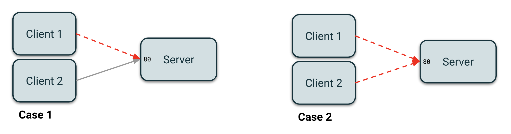
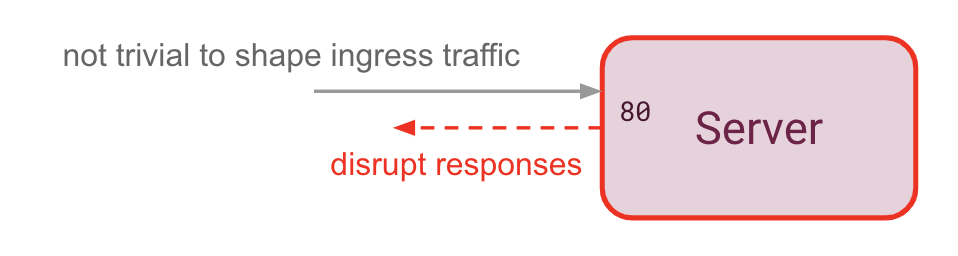

# Network disruption: Traffic Flow

## Q: Should I use egress or ingress for traffic flow?

The `flow` field allows you to either disrupt outgoing traffic (`egress`) or incoming traffic (`ingress`).

Note the following when using `ingress` (learn more in the next section):
* TCP is the only protocol guaranteed to work
* `ingress` flow should only specify `port` and `protocol` fields, not `hosts`

If you are still not sure which one you should use, consider the following example. Say you have 3 pods:
* `server`: an `nginx` pod listening on 80
* `client1`: a pod hitting `nginx` on port 80
* `client2`: another pod hitting `nginx` on port 80

Now let us explore two use cases:

<kbd>
    
</kbd>

### Case 1: I want to disrupt `client1` without impacting `client2`

In this case, you want to target the `client1` pod only and use the `egress` flow so you target packets going from the `client1` pod to the `server` pod.

### Case 2: I want to disrupt all clients

In this case, you want to target the `server` pod and use the `ingress` flow so you target all incoming packets from both `client1` and `client2` pods.

## Q: Why are there limitations on `ingress`?

<kbd>
    
</kbd>

The current implementation of the `ingress` flow is not a real filter on incoming packets but rather a filter on responses to these packets (ie. outgoing packets). During a TCP communication, when the client sends a packet to the server, the server answers with an acknowledgement packet to confirm that it received the client's packet. By disrupting this acknowledgement packet, it simulates an ingress disruption. As such, the `ingress` flow implementation will not work for UDP unless the server depends on the response packets.

Additionally, the `hosts` field cannot be used reliably with `ingress` flow. For instance, if the `nginx` service is in a cluster of pods using the host network, the `hosts` field contains the cluster IP, but the `source IP` field of the packet would have the address of the specific pod from which the request originated. For now, we do not have a solution for resolving cluster IPs to specific pod IPs.
