# Network disruption: Specifying hosts

## Q: When should I specify hosts?

<kbd>
    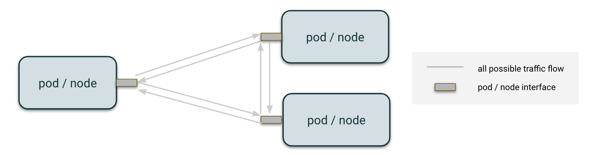
</kbd>

As with all disruptions, pods or nodes are targeted for injection if they satisfy the conditions of the label selector specified in the `selector` field. For network disruptions, we can also specify to only disrupt packets interacting with a particular host or set of hosts through the `hosts` field.

<kbd>
    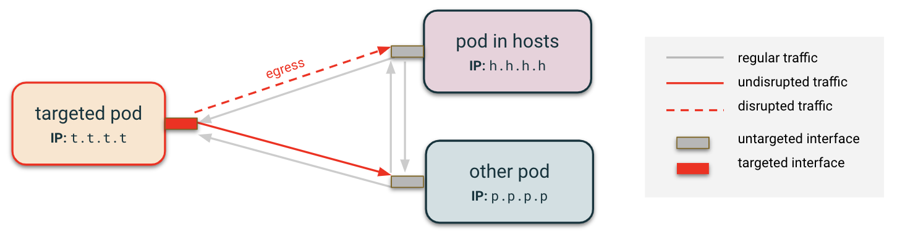
</kbd>

## Notation

Although the `hosts` field is handled the same between pod-level and node-level, the way we target network interfaces varies based on how nodes are configured. For example, whether pods have their own networking interface or use its host's networking directly affects which interface gets targeted:

<kbd>
    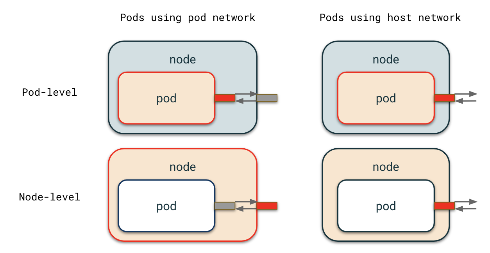
</kbd>

For diagrams in this documentation, arrows represent traffic flow from a particular interface to another. They do not represent the entire path a packet takes to arrive at another pod unless an intermediate device or packet alteration affects how the disruption applies.

<kbd>
    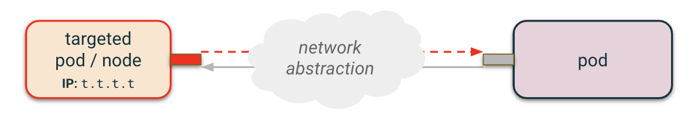
</kbd>

Note also that the flow (`ingress` vs `egress`) for a disruption should be selected deliberately based on [this documentation](/docs/network_disruption_flow.md).

<kbd>
    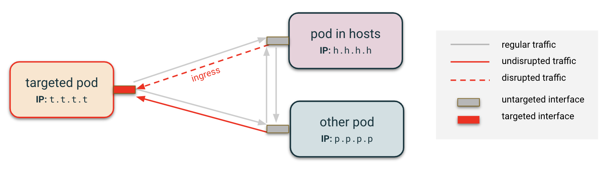
</kbd>

Let's see some examples of different use cases!

### Assumptions

We assume that packets identified as necessary for healthchecks from the cloud service provider or for communications with Kubernetes are ignored.

Additionally, note that the `hosts` field expects a list where the items of the list need not be of the same time (for example, you can have a hostname, IP address, and CIDR block in one disruption). They are visualized separately below to avoid confusion.

See the **Some special cases** section for examples of specifying the `port` and `protocol` fields.

## Pod Level Examples

<kbd>
    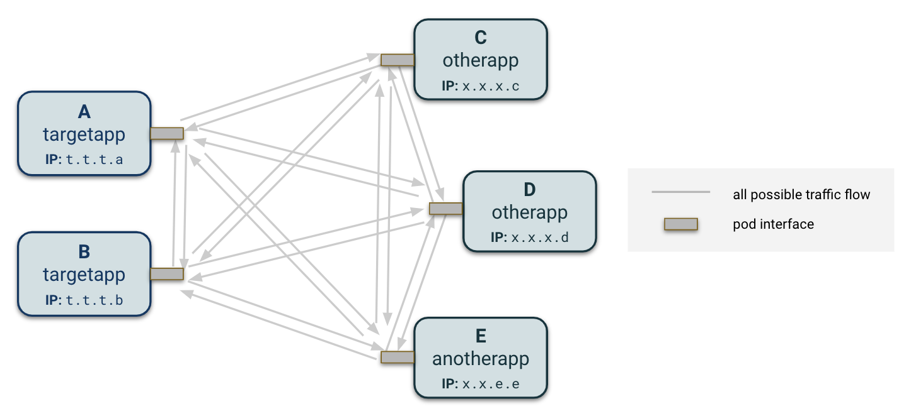
</kbd>

Pods typically have a single interface with which it interacts with the outside world. Let's take this set of pods from various applications and see how different `hosts` field configurations affect the traffic differently.

### Case 1: No host is specified

<kbd>
    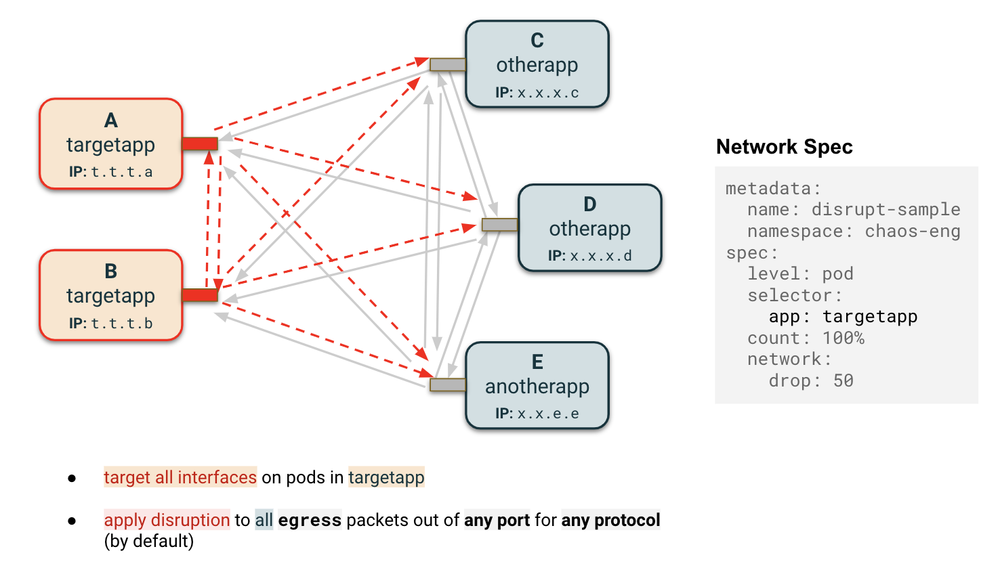
</kbd>

<kbd>
    
</kbd>

If no `hosts` field is specified, all packets aside from those explicitly whitelisted in the **Assumptions** will be disrupted, in this case dropping 50% of traffic leaving (`egress`) or entering (`ingress`) the interface.

Note: `ingress` traffic disruption is only guaranteed for TCP, not UDP. See [this documentation](/docs/network_disruption_flow.md) for more details. For the remainder of this documentation, we will only discuss the default flow configuration (`egress`).

### Case 2: IP address specified

<kbd>
    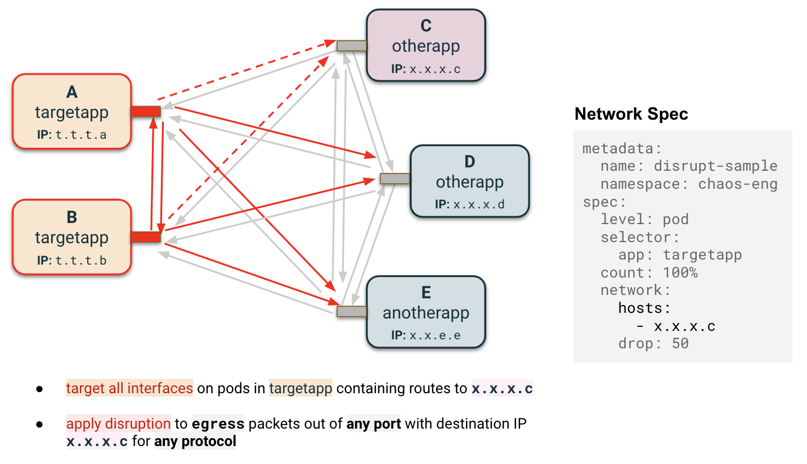
</kbd>

<kbd>
    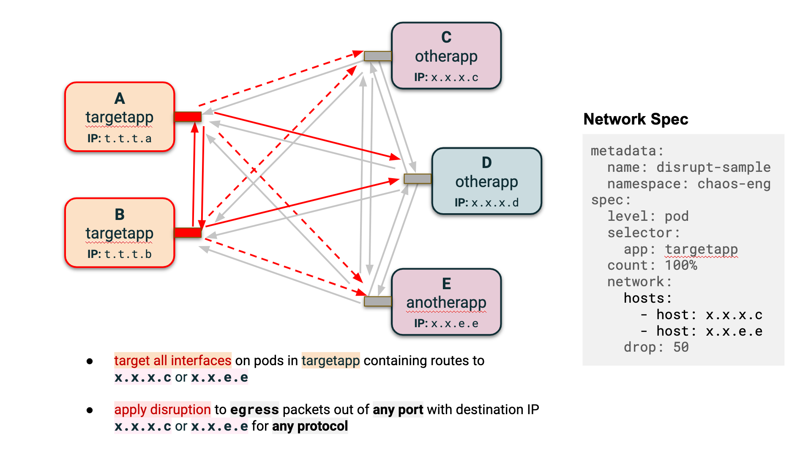
</kbd>

If the `hosts` field contains one or multiple IP addresses, the routing table is consulted, and interfaces containing routes to those IPs will get targeted. In the absence of such interface, the default interface gets selected. In the case of pods, there is usually one interface, `eth0`.

### Case 3: CIDR block specified

<kbd>
    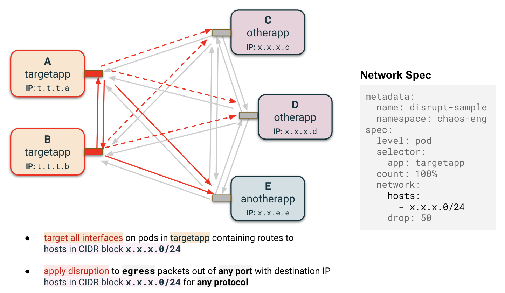
</kbd>

If the `hosts` field contains one or multiple CIDR blocks, the routing table is consulted. If the list of IP addresses in the CIDR block overlap with IP addresses which comprise the route entries of an interface, the interface is targeted. In the absence of such interface, the default interface gets selected.

Note: Only use CIDR blocks with `egress` traffic. 

### Case 4: Hostname specified

<kbd>
    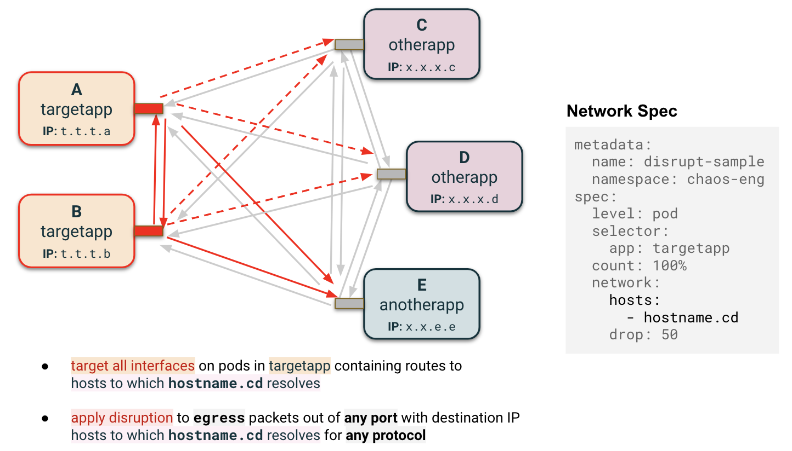
</kbd>

### Some special cases

Cluster IPs can also be specified to target the relevant pods.

<kbd>
    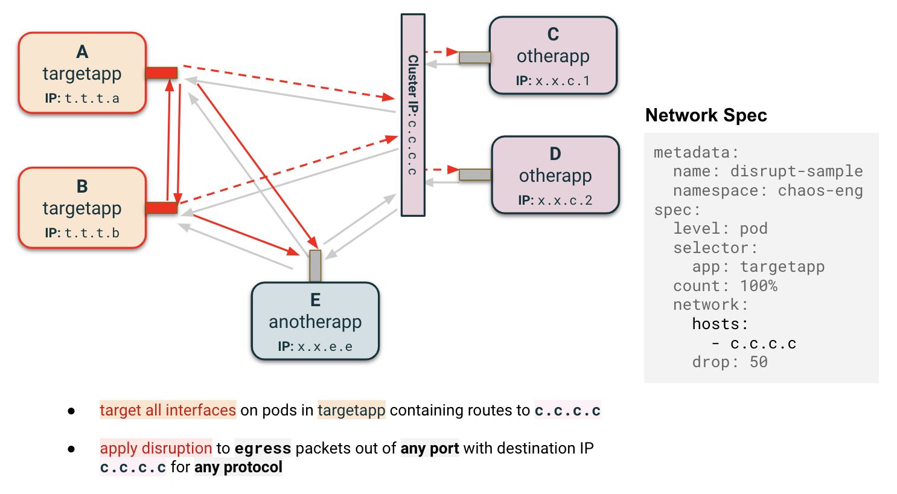
</kbd>

All of these use cases may have `port` configurations, `protocol` configurations, or both can be applied on top of the studied disruption. Packets going through the same interface which do not meet those criteria will be delivered as if they were not targeted (some nuance on this in the [tc documentation](/docs/network_disruption_prio.md)).

<kbd>
    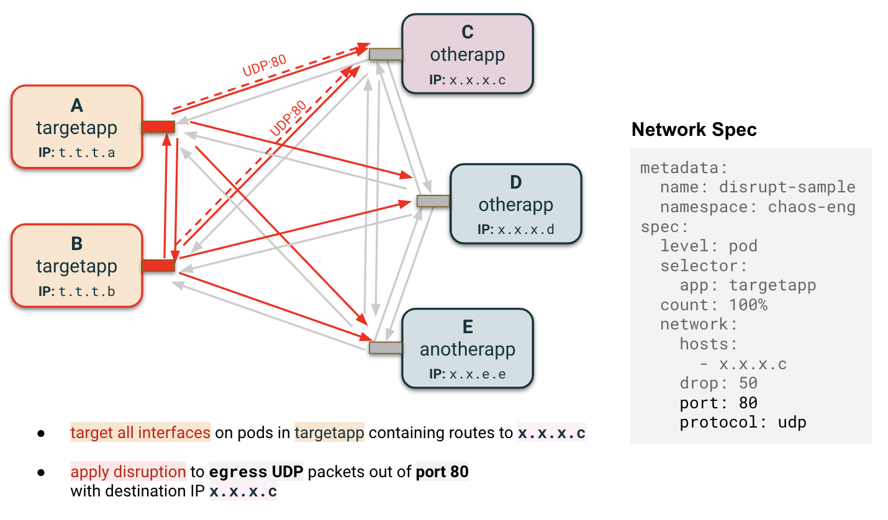
</kbd>

<kbd>
    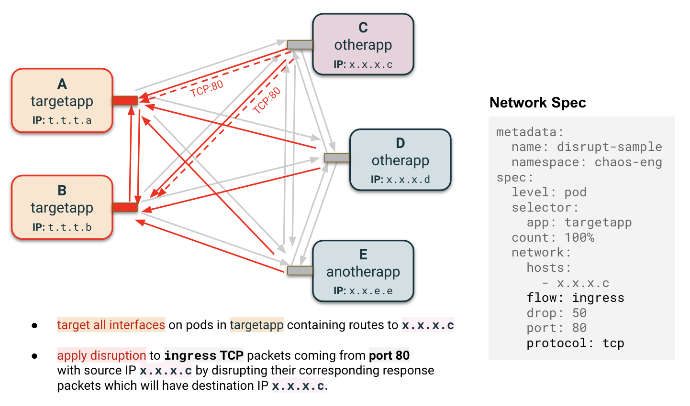
</kbd>

## Node Level Examples

Pods usually come with one network interface. This is common for nodes as well, but large nodes can have multiple interfaces to which pods are assigned one-to-many.

<kbd>
    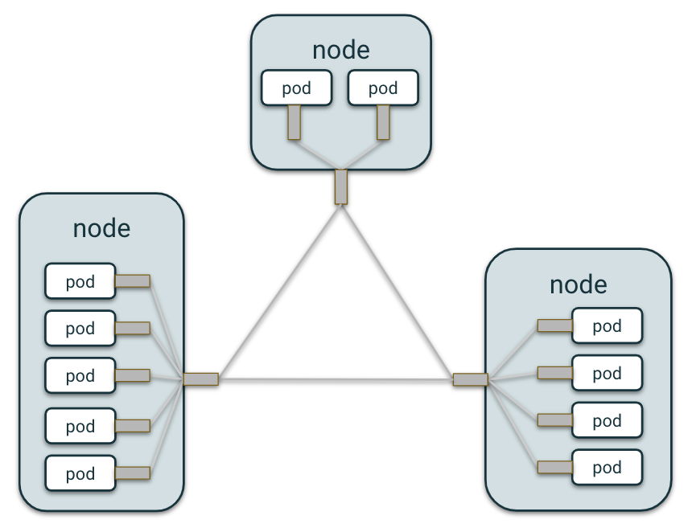
    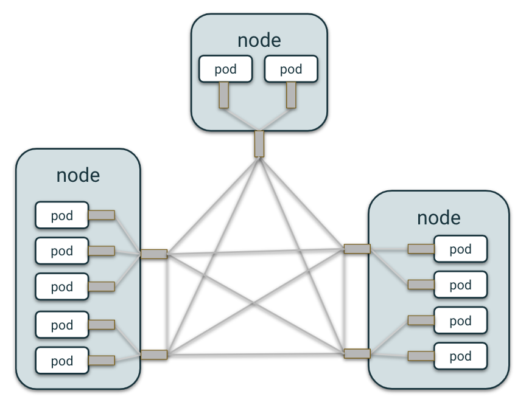
</kbd>

### Case 1: Label selector for a few nodes

When a node is targeted, all interfaces with route table entries to IP addresses specified in `hosts` (for completeness, this can be through an explicit list of IP addresses, CIDR blocks, hostnames, or some combination of these) will be targeted. Exactly as with pod leve, a `tc` rule is applied which impacts packets with destination IPs satisfying these `hosts` criteria.

<kbd>
    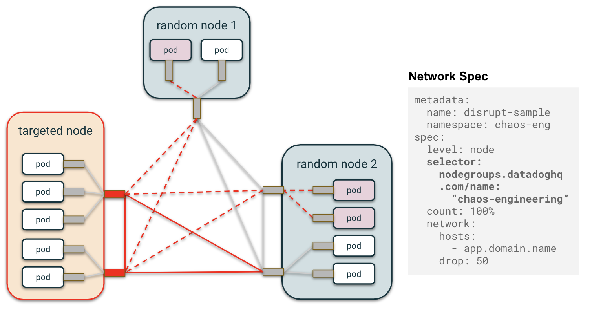
</kbd>

Keep in mind that the diagrams thus far represent that all network interfaces for have a routing entry to any pod we wish to .

<kbd>
    
</kbd>

### Case 2: Disrupting an entire AZ
If we disrupt an entire Availability Zone, note that the pods encompassed by the `hosts` field often fall within the nodes targeted.

<kbd>
    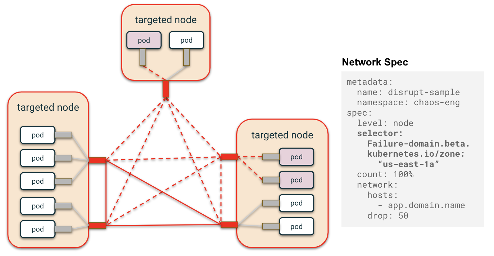
</kbd>

