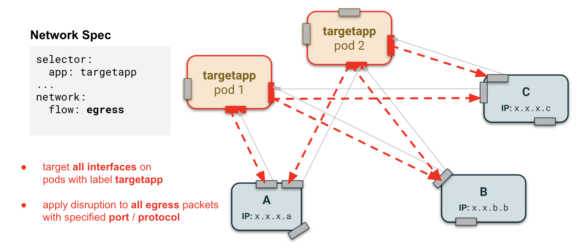
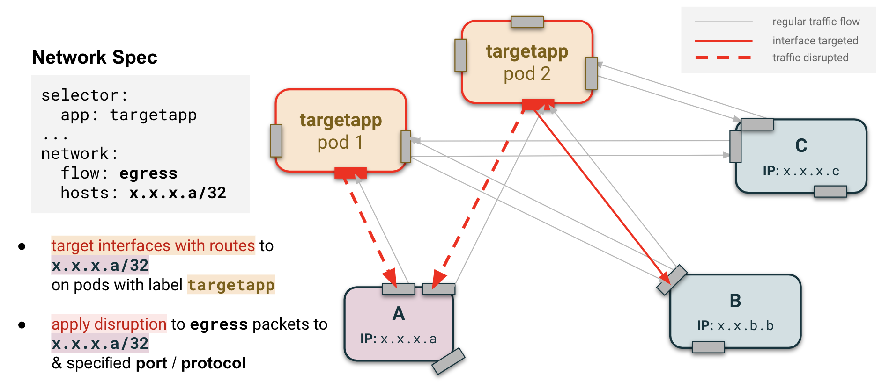
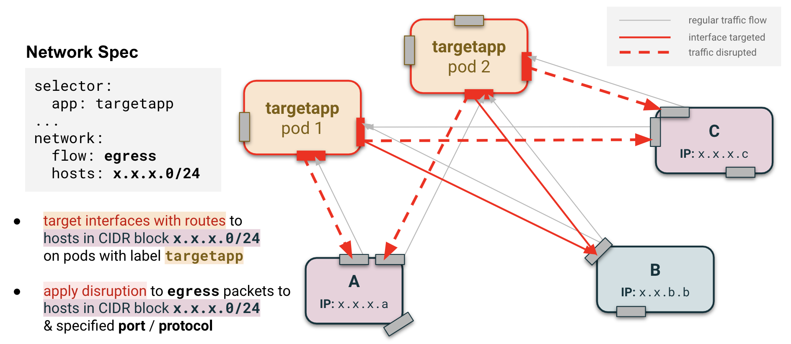
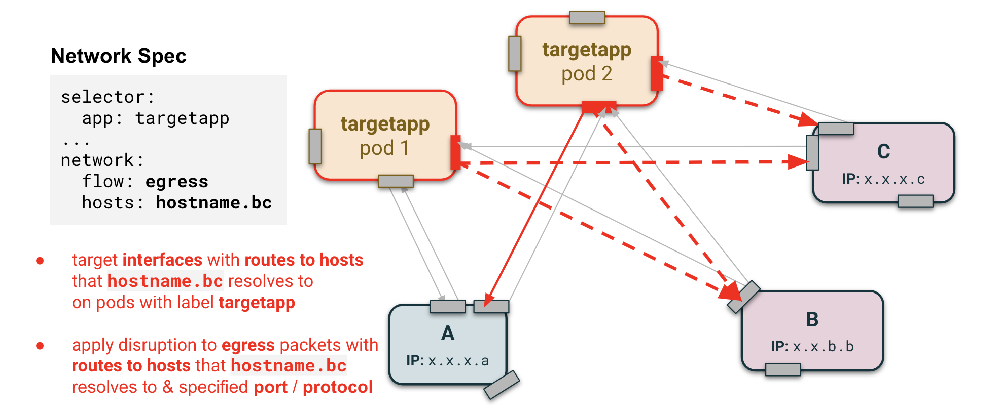

# Network disruption: Specifying hosts

## Q: When should I specify hosts?

As with all disruptions, pods are targeted for injection if they satisfy the conditions of the label selector specified in the `selector` field. For network disruptions, we can also specify to only disrupt packets interacting with a particular host or set of hosts through the `hosts` field. Let's see some examples.

### Assumptions

In each of the following cases, it is assumed that any port or protocol filters are always being applied and that packets identified as necessary for healthchecks from the cloud service provider or for communications with Kubernetes are ignored. It is also assumed that interfaces refer to interfaces for pods which pass the requirements of the label selector.

### Case 1: No host is specified

If no host is specified in the network disruption, the disruptions will be applied to all the outgoing (`egress`) or incoming (`ingress`) traffic on all interfaces.

<kbd>
    
</kbd>

<kbd>
    
</kbd>

### Case 2: CIDR specified

If a CIDR block of one or multiple IP addresses is specified (egress only), the disruptions will be applied to any outgoing traffic on interfaces that contain a route table entry to the specified IP addresses.

<kbd>
    
</kbd>

<kbd>
    
</kbd>

### Case 3: Hostname specified

Instead of a CIDR block, hostnames can be provided for the `hosts` field. If the chaos-controller fails to resolve the `hosts` field to an IP address or a CIDR block, it tries to resolve the potential hostname on each resolver listed in  `/etc/resolv.conf` in order.

<kbd>
    
</kbd>
